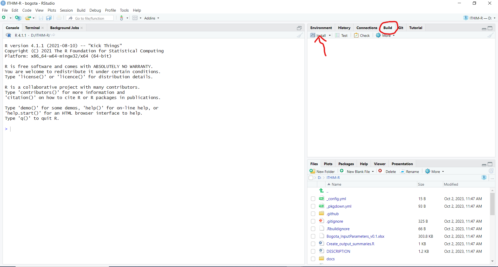
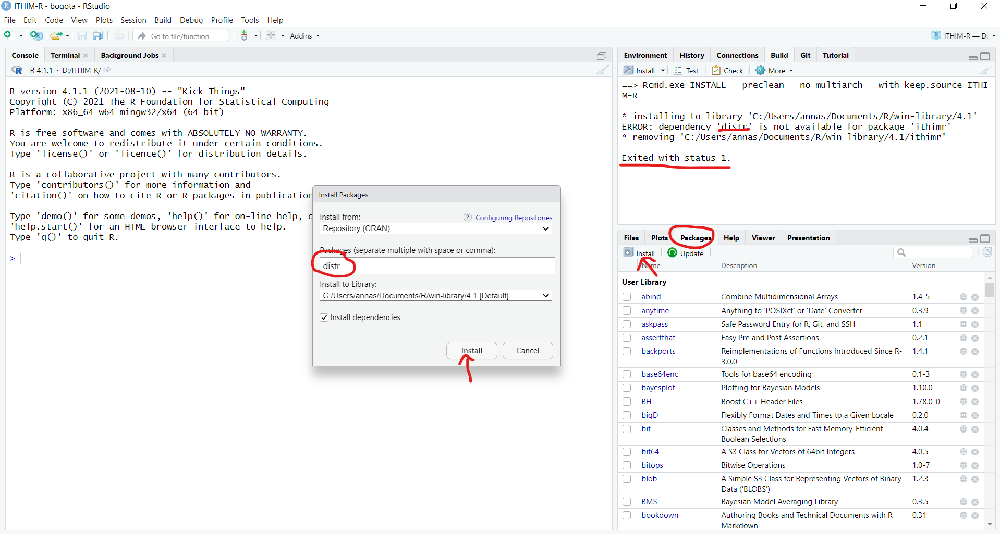
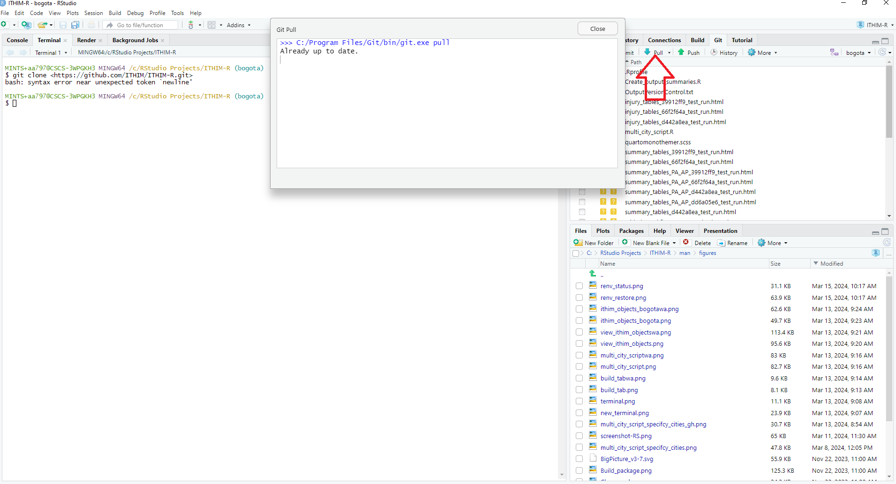
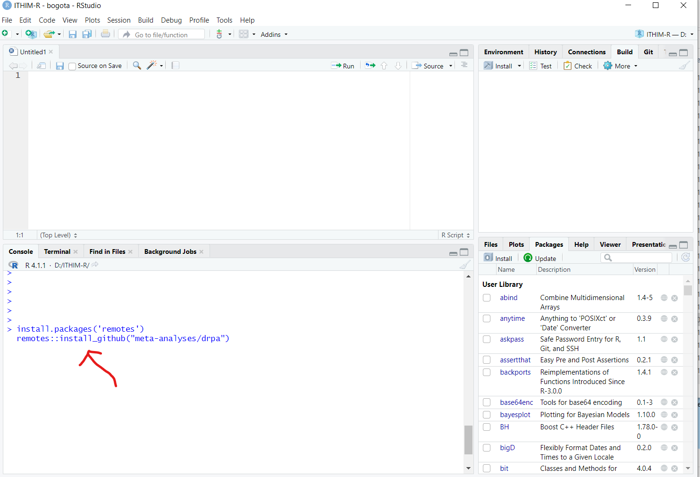
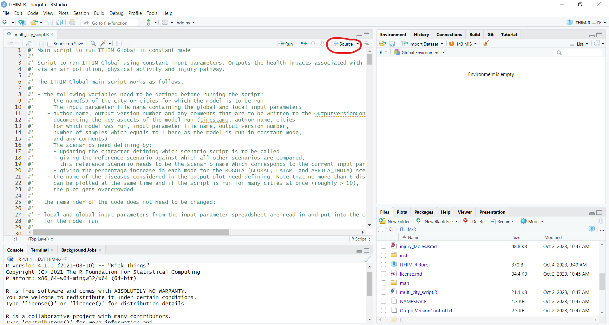
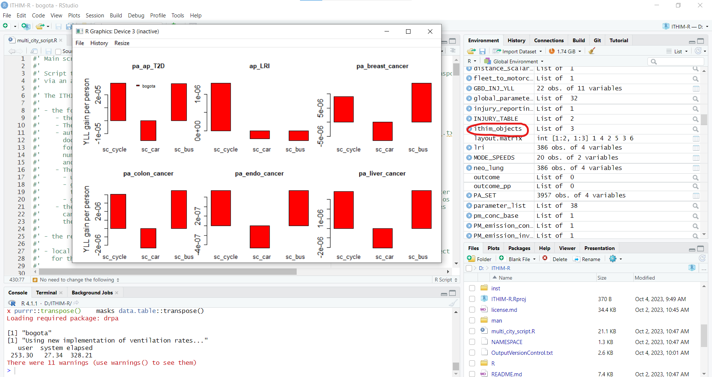

# How to run ITHIM-Global

In this guide we explain how to install the ITHIM-R package, how to run the model ITHIM-Global using this package and how to produce summaries of the key results. 

Please note that the guide was written for Windows 10 but should work similarly for different operating systems.

## How to install the ITHIM-R package

### Pre-requisites

The following programmes need to have been installed before the ITHIM-R package can be used:

- [Git](https://github.com/git-guides/install-git)

- [R](https://cran.r-project.org/)

- [R Studio](https://posit.co/download/rstudio-desktop/)

### Cloning the Github repository

To clone (i.e. download) the ITHIM-R Github repository, open a command window, navigate to the folder in which you want to install the repository in and type:

'git clone https://github.com/ITHIM/ITHIM-R.git'

To change to the Bogota branch for which this guide was written, navigate to the ITHIM-R folder within the command window, then type:

'git checkout bogota'

The Github repository has now been downloaded to your computer and the working branch has been set to the Bogota branch which is the branch this documentation refers to.

### Installing the package in RStudio

To open the ITHIM-R package in RStudio double click on the ITHIM-R.Rproj file inside the ITHIM-R folder saved on your computer. This should open the package in RStudio. 

To install the ITHIM-R package in RStudio, the following steps need to be performed:

1.) If Git has been installed then the there should be a 'Build' tab in the top right hand corner of RStudio. Click on this tab and then on 'Install' in the panel below it. 

This will install the ITHIM-R package but it will also most likely initially throw an error message 'Exited with status 1' stating that some other R packages that are needed for the ITHIM-R package have not yet been installed. To install these missing packages, click on the 'Packages' tab on the right hand side in the middle pane and then on 'Install'. This will open a pop-up window which lets you type in the packages that still need
installing. Click on 'Install'. 

Once all missing R packages have been installed, go back to the 'Build' tab and install the ITHIM-R package again. It should now install smoothly. 

To get the newest updates of the Bogota branch, go to the 'Git' tab in RStudio next to the 'Build' tab and click on 'Pull'. This will automatically download the newest changes from Github. To update the ITHIM-R package on your computer, you need to again go to the 'Build' tab and click on 'Install' again. (Alternatively, if only code but none of the input files have been changed, instead of clicking on 'Install', you can also click on 'More' and then 'Load All' if this option exists for you, i.e. if 'devtools' has been installed. This is a faster way to update the package but will only work for minor code changes.) It is recommended to pull and install the newest updates on a regular basis. 

Finally, you will also have to install the 'drpa' package from Github ([drpa](https://github.com/meta-analyses/drpa)) by first installing the 'remotes' package as explained above and then by typing 

remotes::install_github("meta-analyses/drpa")

into the RStudio console.

## Running ITHIM-Global

To run ITHIM-Global using the ITHIM-R package the various input files and parameters need to be updated first. Then the multi_city_script.R can be used to call the core functions required to run ITHIM-R. Note that the multi_city_script.R is set up to run ITHIM-Global for various cities in one go if required by looping through the cities one by one.

### Update input parameters

There are several input parameter files that need updating before running ITIHM-Global:

- 5 files specific to each city saved in a directory of the city's name. (See [inst/ext/local/bogota](inst/extdata/local/bogota) for example files and also below for further information). These files need to be saved in the inst/extdata/local/'city' folder, where 'city' is replaced by the appropriate city name. 

- file containing the various input parameters for all cities for which the code is to be run saved in the ITHIM-R folder. In this branch, this file is called Bogota_InputParameters_vxx.xlsx, where vxx refers to the latest version number of this file. Here it only contains the input parameters for Bogota but it can easily be extended to contain the input parameter values for various cities. 

- global datasets - such as the dose-response relationships for the air pollution pathway e.g.. These files can be found in the [inst/extdata/global](inst/extdata/global) folder and usually do not need
to be changed. (See below for further information.)

#### City specific files

This section covers the 5 city specific input files required to run the model.

-   **Travel survey** [(example trips dataset)](inst/extdata/local/bogota/trips_bogota.csv%20target=%22_blank). A table of all trips taken by a group of people on a given day. It also includes people who take no trips. This data should come from an official travel survey for the city where possible.

    -   One row per trip (or stage of trip)
    -   Minimal columns: `participant_id`, `age`, `sex`, `trip_mode`, `trip_duration` (or `trip_distance`)
    -   Other columns: `stage_mode`, `stage_duration` (or `stage_distance`)  
    
    

-   **Injury events** [(example injuries dataset)](inst/extdata/local/bogota/injuries_bogota.csv). A table of recorded road-traffic injury (fatality) events in a city during one or more years. 
    -   One row per event
    -   Minimal columns: **victim mode** (`cas_mode`) and **strike mode** (`strike_mode`)
    -   Other columns: `year`, `cas_age`, `cas_gender`, `weight` (weight column should give number of years for which data exists if no `year` information is given)

-   **Disease burden data** [(example burden dataset)](inst/extdata/local/bogota/gbd_bogota.csv). This gives the burden of disease for different diseases. If no city specific information exists, country level information can be used.

    -   One row per disease/metric/age/gender combination
    -   Minimal rows: `Measure` (death/YLL); `sex_name` (Male/Female); `age_name` ('x to y'); `cause_name` (disease names); `val` (value of burden); `population` (number of people `val` corresponds to, e.g. population of country)

-   **Population of city** [(example population dataset)](inst/extdata/local/bogota/population_bogota.csv). This information is used to scale the Burden of Disease data to the city's population in question.

    -   One row per demographic group
    -   Columns: `sex`, `age`, `population`
    -   `age` column should share boundaries with `age_name` in Disease burden data, but can be more aggregated

-   **Physical activity survey** [(example physical activity dataset)](inst/extdata/local/bogota/pa_bogota.csv). This is used to represent the physical activity levels in the city and should be taken from an official physical activity survey of the city where possible. 

    -   One row per person
    -   Columns: `sex`, `age`, `ltpa_marg_met` (total non-occupational PA in a week)

#### Global file inputs

In order to setup the model, we need a fixed list of tables/datasets, such as:

-   [**Disease interaction table**](inst/extdata/global/dose_response/disease_outcomes_lookup.csv). A table with a list of diseases/causes for a specific pathway such as `Air Pollution` and `Physical Activity` and also the interaction between them.

-   **Air Pollution Exposure Response Functions (ERFs)**. These give the exposure response relationships between air pollution (PM2.5) and its impact on health for different diseases/causes. We have collected/cleaned datasets from published studies for this.

-   **Physical Activity Dose-Response Functions (DRFs)**. These are dose response relationships of physical activity and its impact on health for different diseases/causes. Similar to air pollution, this too comes from published studies. This now sits in an independent R package called [`drpa`](https://github.com/meta-analyses/drpa/).

-   **Ventilation rate tables**. This data can be found in [inst/extdata/global/ventilation_rate](inst/extdata/global/ventilation_rate) and details how much air is being inhaled by different people in the model population.

### Call multi_city_script.R 

In order to run ITHIM-R once it has been installed and the various input files described above have been updated, open the `multi_city_script.R` file within RStudio. (This file can be found under the 'Files' tab in the middle pane on the right hand side). This is the key script to run ITIHM-Global in constant mode (i.e. without sampling the input parameters from distributions). It reads in all the required datasets and initialises all variables by calling `run_ithim_setup` and then runs the model by calling `run_ithim`.

First update the parameter values at the beginning of the script to set-up e.g. for which city / cities the script is to be run. If several city names are given as a vector, the model performs the ITHIM-R analysis for one city after another. 

Once these parameter values have been updated, click on 'Source' and the model should run. 

It produces pop-up windows showing the plots of the results giving the years of life lost for each scenario and required disease outcome. 

## Results

Apart from the pop-up windows produced at the end of the `multi_city_script.R` which give the years of life lost for each scenario and disease outcome, the main file containing the model outputs is the `ithim_objects` list, which is saved under *results/multi_city/io_,'output_version',.rds*, where the output_version is currently set as the SHA number (i.e. the unique identifier) of the latest update on Github but can also be updated manually by the user. 

The health effects of ITHIM are presented as years of life lost (YLLs) and number of attributable deaths. The background burden data for the study areas are estimated from the [Global Burden of Disease studies](https://www.healthdata.org/research-analysis/gbd).

### ithim_objects 

The ithim_objects list is saved under *results/multi_city/io_",output_version,".rds*, where the output_version is currently set as the SHA number (i.e. the unique identifier) of the latest update on Github but can also be updated manually by the user in the `multi_city_script.R`. 

This list contains a comprehensive set of intermediate and final results from the model run:

For each city it contains the following data: 

- **trip_scen_sets**: trip data for all scenarios for the synthetic population, i.e. the population sample built by combining the physical activity survey and travel survey data. 

- **dist**: total stage mode distances for each mode and scenario (incl. baseline) for the synthetic population.

- **dur**: total stage mode durations for each mode and scenario (incl. baseline) for the synthetic population.

- **true_dist**: distances from the trip data scaled up to the total distance travelled by the population of the city (for age ranges considered in the model only) for each scenario (incl. baseline) and mode of transport.

- **inj_distances**:

  - **true_distances**: city population mode distances by age category and sex considered in the model.
  
  - **injuries_list**: For all scenarios (incl. baseline) two lists are given, one for 'whw' (who-hit-whom) accidents where both the strike and the casualty mode are known and one for 'nov' (no other vehicle) accidents where no strike vehicle was involved in the accident. These lists contain all casualty (and strike) mode combinations by age category and sex. Furthermore, they detail casualty (and strike) mode distances travelled by the entire city population considered in the model ('_sum') or just by the respective age and sex category. They also detail the casualty (and strike) mode exponents used in the injury Poisson model. 

  
  - **reg_model**: parameterised Poisson injury regression model.
  
  - **injuries_for_model**: baseline data containing fatality counts for all casualty and strike mode combinations with associated city population distance data.

- **demographic**: city population counts for all age category and sex combinations considered in the model.

- **synth_pop**: population extracted from the physical activity survey giving the marginal met leisure physical activity values for each person.

- **outcomes**:

  - **mmets**: Marginal MET values for each person in the synthetic population for each scenario.
  
  - **pm_conc_pp**: PM2.5 concentration attributed to each person in the synthetic population for each scenario (incl. baseline).
  
  - **co2_conc**: total CO2 concentration levels for each mode of transport and scenario (incl. baseline).
  
  - **ref_injuries**: number of injury deaths and years of life lost by age and sex category for the reference scenario including upper and lower boundaries.
  
  - **hb**: health burden (deaths and years of life lost (YLLs) in two separate dataframes) for each age and sex category and each disease using the combined result for diseases affected by both air pollution and physical activity levels.
  
  - **pathway_hb**: health burden (deaths and years of life lost (YLLs) in two separate dataframes) for each age and sex category and each disease keeping the results for diseases affected by both air pollution and physical activity levels separate.
  
  - **whw**: number of fatalities by strike and casualty modes for who-hit-whom and no-other-vehicle injuries for all scenarios (incl. baseline).
  
  

- **disease_burden**: disease burden for all diseases for the baseline scenario (deaths and years of life lost) for all age and sex categories considered in the model (from input data).

- **PM_emission_inventory**: PM emission inventory by mode of transport for the baseline scenario (from input data).

- **injury_table**: summarised total injury counts from the injury input data by age and sex category and strike and casualty mode for all years ('weight' column) given in the input data for both 'whw' (who-hit-whom) and 'nov' (no-other-vehicle) accidents.

- **vehicle_inventory**: gives the speed and CO2 and PM2.5 emissions inventories for all vehicles in the baseline scenario.

- **location**: country and continent information.

- **new_walk_trips_count**: number of rail and bus trips to which an additional walking stage was added during the model run.

**Scen_prop**:

- the proportion of trips by mode to be converted for each distance category and scenario.

**Ithim_run**:

- information about the ITHIM-R run such as the name of the input parameter file, the name of the scenario definition used, the reference scenario, the scenario names, the computation mode (constant or sample), the timestamp of the model run, the output version number, the author of the model run and any additional comments about this particular model run. 

### Summary of key results - NEEDS FURTHER WORK!!!!!

There are various scripts which can be used to produce output summary tables of the results

- call markdown documents

- output .html files

- csv files (location where stored)

- results_app - Shiny application

## Structure of ITHIM-Global Github repository - Bogota branch

The Github repository of the Bogota branch is structured as follows:

- **.github**: specifies the metadata for the various documents, automatically created by Github.

- **R**: contains all the R functions written for the ITIHM-R package.

- **docs**: documentation of the ITHIM-R package which is build automatically.

- **inst/extdata**: folder containing the local city specific and the global input files.

- **man**: manual containing the various functions used within ITHIM-R and the figures used in the various documentation documents. It is also build automatically.

- **results**: contains the results from the model runs.

- **results_app**: contains the functions used to produce Shiny pivot tables of the results.

- .Rbuildignore, .gitignore: metadata created by Github.

- Bogota_InputParameters_vxx.xlsx - file containing the city specific input parameters which needs manual updating.

- Create_output_summaries.R - wrapper script to create the various output documents.

- DESCRIPTION: automatically created by Github.

- How_To_Run_ITHIM: document describing the various steps needed to run the ITHIM-Global model from downloading and installing ITHIM-R to preparing the input parameter files and running the code. 

- ITHIM-R.Rproj: contains the metadata for the ITHIM-R package.

- NAMESPACE: automatically created by Github.

- OutputVersionControl.txt: file storing the main run information of the ITHIM-R runs. This is automatically updated, if required, when using the multi_city_script.R. 

- README: document giving an overview of the ITHIM-R package.

- _config.yml, _pkgdown.yml: metadata created by Github.

- injury_tables.Rmd: xxxxxxxxxxxxxxxxxxxx

- license.md: details the license conditions when using this ITHIM-R package.

- multi_city_script.R: wrapper function to call all the various functions needed to perform the ITHIM-Global analysis. 

- summary_tables.Rmd: xxxxxxxx

- summary_tables_SHAnumber: xxxxxx

- summary_tables_PA: xxxxxxxxxx

