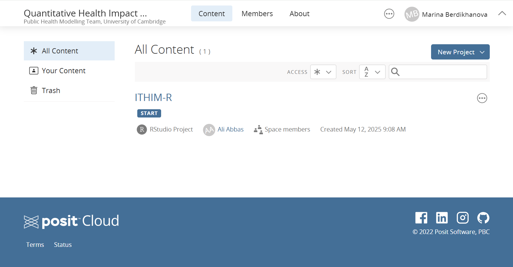
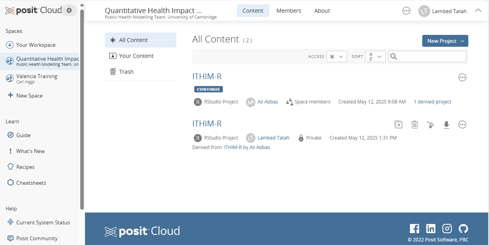
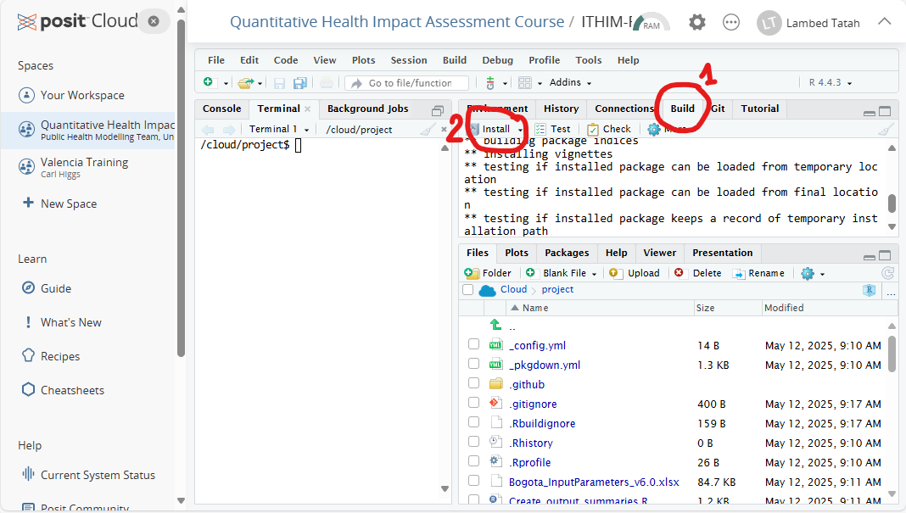
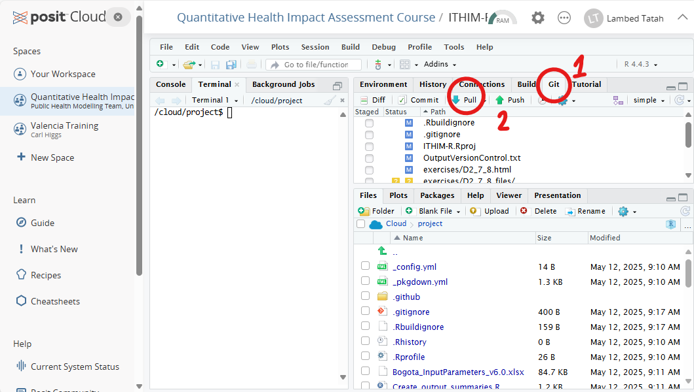
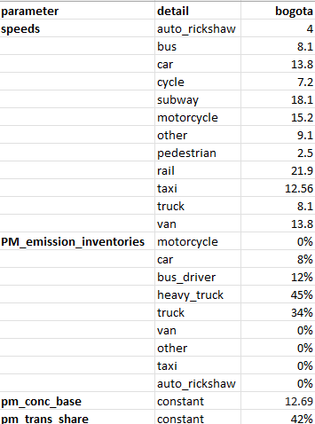
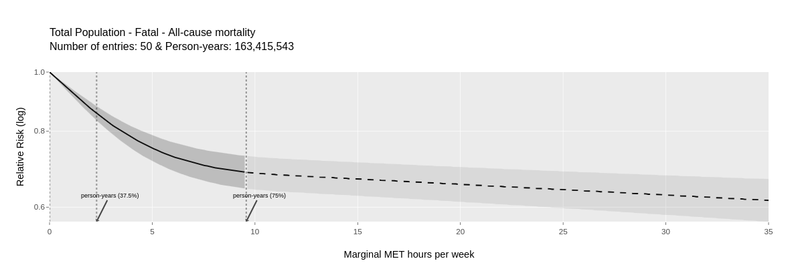
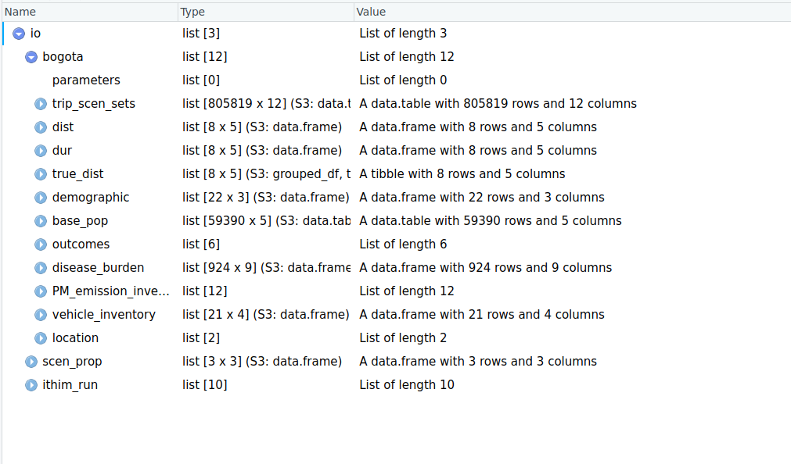

# Setup Rstudio and ITHIM Global V2 (65 mins)

-   Setup Posit cloud (30 min)

-   Install the ITHIM-Global V2 package (45 min)

## Setup posit cloud (20 mins)

### Overview (5 mins)

-   Introduce Posit cloud and its benefits for collaborative R work.

    -   What is Posit cloud? Cloud-based RStudio IDE accessible via browser.

    -   Key features: no local installation, reproducible environments, easy sharing.

    -   Use cases: teaching labs, workshops, remote collaboration.

---

### Student account setup (5 mins)

-   Navigate to [https://posit.cloud](Posit%20Cloud) (using the invitation link sent to your email).

-   Click **Sign Up** with your email registration or choose Google, GitHub etc

-   Verify your email if prompted.

-   Briefly explore the dashboard:

    -   **Projects** pane

    -   **Access** and **Settings**

    -   Join the space: <https://posit.cloud/spaces/647431/> - if not already

---

### Q&A and next steps (10 mins)

-   Recap:

    -   Account setup

    -   Project creation from GitHub (pulling from GitHub)

    -   Running starter scripts

-   Answer any immediate questions.

-   Direct participants to lab instructions to [posit cloud guide](https://docs.posit.co/cloud/guide/projects/).

## Install the ITHIM-Global V2 package (45 mins) \[1/3\]

-   Your landing page for the ithim-global-v2 package will look like the figure below

    

## Install the ITHIM-Global V2 package (45 mins)

-   When you click on the project (START), it should create a copy like this (\~5 mins)

    

## Install the ITHIM-Global V2 package (45 mins)

-   Once the ITHIM project is open

-   Run the following lines to install/update the required packages \~25mins

    -   `renv::install()` #(installs most of the needed packages/dependencies) (\~1min)

    -   `renv::install("meta-analyses/drpa")` #(adds the drpa package that failed to install) (\~20 mins)

    -   `install.packages(c("plotly", "ReIns", "distr", "pracma", "truncnorm" ))` #(add other packages) (\~3 mins)

-   Build a functional package from the downloaded scripts as follows: (\<1min)

    

## Keeping up to date

-   We may ask you to pull changes to the exercises from GitHub. In that case, follow the steps below:

    -   Click on the Git–\>pull buttons shown in the figure

        

    -   These changes will pertain to the exercises, so you can follow the instructions in the exercises

    -   If we have made some changes to the model itself, you will need to rebuild the package as detailed above and in the vignette

# Break (10 mins)

# Overview of ITHIM Global V2 (40 mins)

## Agenda

-   Why global version 2?

-   Structure of the model

    -   Diagram

    -   Input datasets

    -   Input Parameters

-   What are the main ingredients?

    -   Physical Activity (PA)

    -   Air Pollution (AP)

-   Shiny Interface

    -   Travel behaviours

    -   Physical Acitivity (PA) and Air Pollution (AP) exposures

    -   Health Outcomes

-   Summary

## Why ITHIM Global V2?

```{r}
#| echo: false
# Load the package
library(ithimr)
# and other useful ones
library(tidyverse)
# gt
library(gt)

io <- readRDS(paste0("../results/multi_city/io.rds"))

all_cause_ap <- read_csv("../inst/extdata/global/dose_response/drap/extdata/all_cause_ap.csv")

city <- 'bogota'

gt_big_font_size <- 40
gt_small_font_size <- 25
```

## Issues with travel surveys

-   One day travel surveys are of poor quality with:

    -   Missing modes

    -   Missing trips

-   Under-reporting of short trips, such as walking trips (non-work related trips in general)

-   Doesn't capture variability in travel behaviour within individuals

-   Sample size limitations

-   Requirement: a week-long representative travel behaviour dataset that tackles such issues

## Synthetic travel behaviour dataset \[By Ismail\]

-   **Generate weekly trips per person**\
    Using statistical models and National Travel Survey (NTS) England 7-day data, weekly trip frequency per person is calculated based on age, gender, and occupation status.

-   **Assign travel times to trips**\
    Using a regression model, based on one-day travel survey data from 27 Latin, African and Indian cities, assign trip duration based on age, gender, city-level attributes (population, GDP, size), travel mode shares, and network indicators (elevation, street lengths)

-   **Predict trip mode via classification model**\
    Lastly, using a classification model based on the same set of variables mentioned earlier, plus trip duration, predict trip mode

## Model Structure


## Synthetic Trip Dataset (1/2)

A modelled week long synthetic trip dataset in which each row represents a trip with:

-   **Individual-level variables**

    -   **participant_id**: unique ID for each individual
    -   **age**: participant's age as an integer
    -   **sex**: male or female

-   **Trip-level variables:**

    -   **trip_id**: unique ID for each trip made by each individual
    -   **trip_mode**: main mode of the trip
    -   **trip_distance**: total trip distance in kilometers

## Synthetic Trip dataset (2/2)

-   **Stage-level variables:**
    -   **stage_mode**: Mode of the trip stage
    -   **stage_duration**: Duration of each stage in minutes

. . .

```{r}
#| echo: false


#
# io[[city]]$trip_scen_sets |> filter(scenario == "baseline") |> dplyr::select(-c(scenario, ends_with("cat"))) |> arrange(trip_id) |> head() |> knitr::kable() |> kableExtra::landscape()

io[[city]]$trip_scen_sets |> filter(scenario == "baseline") |> dplyr::select(-c(scenario, ends_with("cat"))) |> arrange(trip_id) |> mutate(across(where(is.double), round, 2)) |> head() |> gt(caption = "Trip dataset with demographics and trip details") |> tab_options(table.font.size = gt_big_font_size) |> 
 gt::as_raw_html()

```

## Base population with PA Dataset

Based on the individuals in the synthetic trip dataset, we create a dataset that identifies all participants with their demographics and assigns a background weekly leisure PA to each participant based on a distribution

-   **Base population with PA**

    -   **participant_id**: unique person ID (integer)
    -   **age**: numeric age
    -   **sex**: male or female
    -   **ltpa_marg_met:** leisure-time (non-transport) physical activity in marginal metabolic equivalent task hours (mMET-hrs) per week
    -   

```{r, results='asis'}
#| echo: false
io[[city]]$base_pop |> arrange(participant_id) |> rename(ltpa_marg_met = work_ltpa_marg_met) |>   mutate(across(where(is.double), round, 2)) |> head() |> gt(caption = "Base population with background PA in mMET-hrs per week") |> tab_options(table.font.size = gt_small_font_size) |> gt::as_raw_html()

```

## Burden of Disease (BoD) dataset (1/2)

Cause specific disease burden data from Institute for Health Metrics and Evaluation **IHME's** global burden of disease database (<https://ghdx.healthdata.org/gbd-2019>)

-   **Burden data**

    -   **measure**: Deaths or Years of Life Lost (YLLs)
    -   **age**: age group - usually a five year band as integer
    -   **cause**: cause/disease (*details later on*)
    -   **population**: population size by age and gender group
    -   **mix_age**: minimum age in integer for the current age and gender group
    -   **max_age**: maximum age in integer for the current age and gender group
    -   **rate**: rate of risk of measure per person
    -   **burden**: burden of the measure for the *population*

## Burden of Disease (BoD) dataset (2/2)

```{r, results='asis'}
#| echo: false
io[[city]]$disease_burden |> mutate(across(where(is.double), round, 2)) |> head() |> gt(caption = "Burden of Disease dataset") |> tab_options(table.font.size = gt_big_font_size) |> gt::as_raw_html()

```

## Population Dataset

The demographic information is by age and gender. This also comes from **IHME's** global burden of disease database (<https://ghdx.healthdata.org/gbd-2019>)

-   **Population**

    -   **sex**: male or female
    -   **age**: age group - usually a five year band as integer
    -   **population**: population size
    -   

```{r, results='asis'}
#| echo: false
io[[city]]$demographic |> mutate(across(where(is.double), round, 2)) |> head() |> gt(caption = "Population dataset with sex and age groups") |> tab_options(table.font.size = gt_big_font_size) |>  gt::as_raw_html()
```

## Parameters

{fig-align="center"}

## What are the main ingredients?

## Physical activity

-   Travel related PA volume comes from active travel (cycling and walking)
-   Background PA volume comes from baseline population (using a distribution)

## Non-linear dose-response curve



## PA dose-response

```{r}
#| eval: true 
#| echo: false
#| results: asis

RR <- (drpa::dose_response(cause = "all-cause-mortality", outcome_type = "fatal", 
                          dose = c(0, 5, 10))$rr)
Dose <- c(0, 5, 10)

data.frame(Dose, RR) |> mutate(across(where(is.double), round, 2)) |> 
  gt(caption = "PA dose-response relationship for all-cause-mortality") |>
  tab_options(table.font.size = gt_big_font_size) |> 
  gt::as_raw_html()
```

## PA - Potential Impact Fraction

$$ pif = (RR_{base} - RR_{scenario})/RR_{base} $$

```{r}
#| eval: true 
#| echo: false

calculate_pa_pif <- function(base_dose, scen_dose){
  
  rr_base <- drpa::dose_response(cause = "all-cause-mortality", outcome_type = "fatal", dose = base_dose)$rr
  
  rr_scen <- drpa::dose_response(cause = "all-cause-mortality", outcome_type = "fatal", dose = scen_dose)$rr
  
  return((rr_base - rr_scen)/rr_base)
}

calculate_ap_pif <- function(base_dose, scen_dose){
  
  rr_base <- ithimr::AP_dose_response(cause = "all_cause_ap", dose = base_dose, quantile = 0.5)$rr
  
  rr_scen <- ithimr::AP_dose_response(cause = "all_cause_ap", dose = scen_dose, quantile = 0.5)$rr
  
  return((rr_base - rr_scen)/rr_base)
}

```

. . .

PIF with baseline PA volume (5) mMET-hours per week and scenario PA volume (10) mMET-hours per week

```{r}
#| eval: true 
#| code-line-numbers: "|1|2"
#| echo: false

pa_pif <- calculate_pa_pif(base_dose = 5, scen_dose = 10)
print(round(pa_pif, 2))
```

. . .

PIF with baseline PA volume 10 mMET-hours per week and scenario PA volume 15 mMET-hours per week

```{r}
#| eval: true 
#| code-line-numbers: "|1|2"
#| echo: false

pa_pif <- calculate_pa_pif(base_dose = 10, scen_dose = 15)
print(round(pa_pif, 2))
```

## Air Pollution

Personal exposure of PM2.5 is calculated based on:

-   Travel mode specific exposures, such as more exposed while cycling than travelling in a car

-   Ventilation rates (based on BMI)

-   Time spent in travel mode

-   Time spent during rest of the day in activities (such as sleeping, resting and doing light and vigorous physical activities)

$$ PM2.5_{inhaled} = TravelMode_{dur} * Vent_{rate}  * ExposureRates_{mode} * PM2.5Conc $$

## AP dose-response (exposure response)

```{r}
#| eval: true
#| echo: false


RR <-  ithimr::AP_dose_response(cause = "all_cause_ap", dose = c(0, 5, 10), quantile = 0.5)$rr
                          
Dose <- c(0, 5, 10)

data.frame(Dose, RR) |> mutate_if(is.numeric, round, 2) |> gt(caption = "Doses (exposures) and their relative risk for all cause mortality for PM2.5") |> tab_options(table.font.size = gt_big_font_size)

```

## AP - Potential Impact Fraction

$$ pif = (RRbase - RRscenario)/RRbase $$

PIF with baseline AP (PM 2.5) exposure of (5) and scenario AP exposure of (10)

```{r}
#| eval: true 
#| code-line-numbers: "|1|2"
#| echo: false

#-0.03923048
ap_pif2 <- calculate_ap_pif(base_dose = 5, scen_dose = 10)
print(round(ap_pif2, 2))
```

```         
```

. . .

PIF with baseline AP (PM 2.5) exposure of (10) and scenario AP exposure of (15)

```{r}
#| eval: true 
#| code-line-numbers: "|1|2"
#| echo: false

ap_pif2 <- calculate_ap_pif(base_dose = 10, scen_dose = 15)
print(round(ap_pif2, 2))
```

## Summary

-   A global generalised model that uses synthetic travel behaviour and easy to get city-specific handful of parameters
-   Include injury risks - similar to HEAT and ITHIM global V1, by:
    -   Population
    -   Duration
    -   Distance
-   Health modelling using more advanced techniques such as proportional multi-state life table
-   Include other pollutants such as black carbon, NO2

# Run the multi_city script (10 mins)

-   Source the multi_city script as follows (calls the packages and runs the model)

# Explore ITHIM functions and outputs (25 mins)

## Locate the ithim_object (io) output

-   Once the multi_city script finishes running, it outputs an ithim_object (io_rds), which contains almost everything that you need

    -   Locate the folders where io.rds sits - (ITHIM-R/results/multi_city/io.rds)

    -   Import it by clicking on it

    -   Open it by `View(io)` and familiarize yourself with its strucutre

    -   

        -   Further details of each object can be foudn here: <https://ithim.github.io/ITHIM-R/articles/how-to-run-ITHIM.html#ithim_objects>

## Explore functions in multi-city script

-   Let's take a deeper look at the functions we can easily modify in the multi_city script

-   Identify the following chunks in the script

    -   City called

    -   parameters called

    -   scenario definition

    -   Two main ithim functions:

        -   `run_ithim_setup` - setting up parameters and scenario for `bogota` . Documentation here: <https://ithim.github.io/ITHIM-R/reference/run_ithim.html>

        -   `run_ithim` - running the model. Documentation here: <https://ithim.github.io/ITHIM-R/reference/run_ithim_setup.html>
