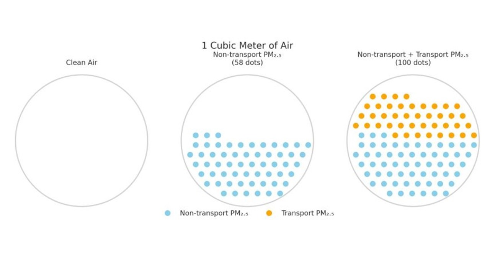
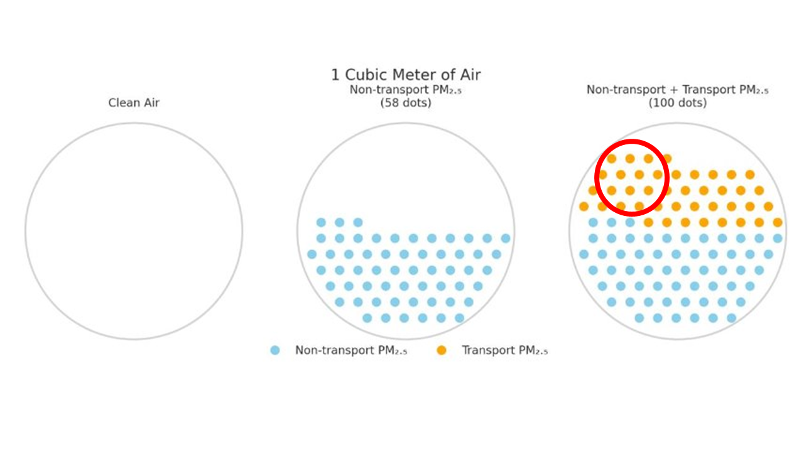
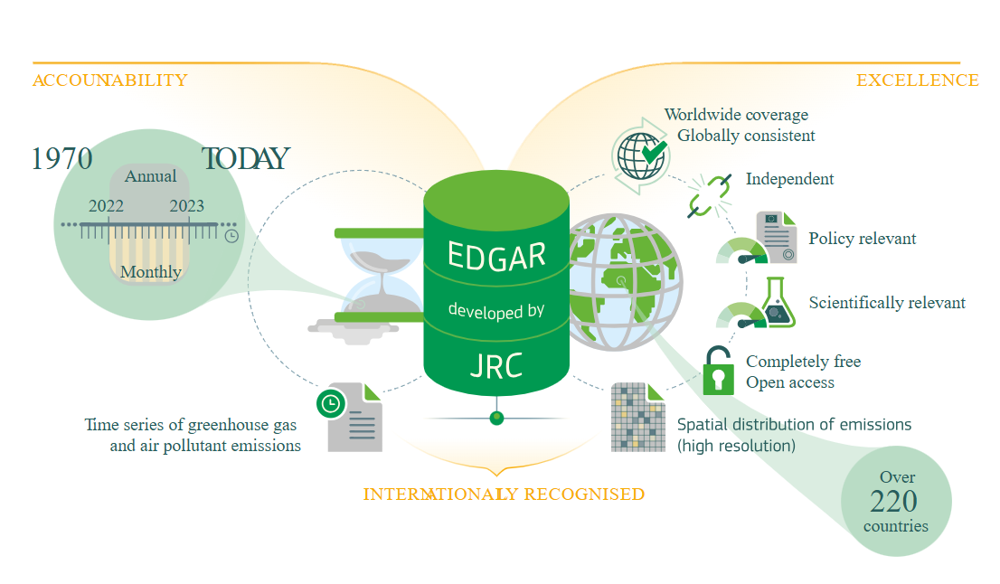

# Setup and call the ithim object `io`

-   Yesterday, you ran the ITHIM model and saved the outputs in `io`. It now has been called here

```{r read_io, message=FALSE, warning=FALSE}
# Read the RDS file

io <- readRDS("data/io.rds")
```

# Take a look again at some AP outputs in io

-   Explore the structure of the `io` object
    -   eg display the objects in:
        -   io (list),
        -   bogota (list),
        -   dis (table),
        -   dur (table),
        -   outcomes (list)

```{r explore_io, message=FALSE, warning=FALSE}
io$bogota$___
```

# Individual AP (PM2.5) exposure depends on:

-   Background PM2.5 concentration
-   Exposure factor (scaling to micro-environment during travels)
-   Inhalation rate (activity-dependent)

## Calculate changes in background AP (PM2.5) concentration

-   What do we need to estimate changes in background AP concentration?
    1.  Baseline background PM2.5 concentration
    2.  Transport share of PM2.5
    3.  Vehicle emission inventory
    4.  Relative change in vehicle travel distance
    5.  Combine the above variables

### 1. Baseline background PM2.5 concentration

-   We get values from https://www.who.int/data/gho/data/themes/air-pollution/who-air-quality-database
-   We assume an average value (ignoring spatial and temporal variations)
-   Remember that there is an advancement in these estimates
    -   better resolution mapetctc

```{r background_pm, message=FALSE, warning=FALSE}
conc_base_pm <- 12.69

# what sources do people use
```

### 2. Transport share of PM2.5

-   Varies by city heydari 2020 (Shahram Heydari)

    ```{r trans_share1, message=FALSE, warning=FALSE}
    transport_share <- 0.42
    ```

    

-   \~80% is from trucks so actually what we are changing is \~20%



### 3. Vehicle emission inventory

-   Focus on the modes relevant to our calculations

-   We use values from EDGAR

    

    <https://data.jrc.ec.europa.eu/collection/edgar>

    <https://edgar.jrc.ec.europa.eu/dataset_ap81>

    -   Gives emissions from different vehicles on a world grid
    -   We average over a city

    ```{r emission_inventory, message=FALSE, warning=FALSE}
    library(dplyr)

    transport_emission <- 
      io$bogota$vehicle_inventory|>
      filter(PM_emission_inventory != 0) |> 
      filter(!(grepl("truck", stage_mode)))|> 
      select(-CO2_emission_inventory, -speed)


    transport_emission
    ```

### 4. Relative change in vehicle travel distance

-   Read the `trip` dataset from the `io` object

```{r read_trip_set, message=FALSE, warning=FALSE}
#trips <- io$bogota$trip_scen_set
```

-   Calculate distance per person by mode

```{r ind_distance, message=FALSE, warning=FALSE}

trips |>
#filter(stage_mode %in% c("car_driver", "bus_driver", "motorcycle"))|>
group_by(stage_mode, scenario) |> 
reframe(mean_dist = sum(_______) / nrow(io$bogota$base_pop)) |> 
pivot_wider(names_from = stage_mode, values_from = mean_dist)|> 
filter(scenario=="baseline")

```

-   Calculate the distance travelled by vehicles in the travel dataset at baseline

```{r data_vehicle_distance_baseline, message=FALSE, warning=FALSE}
trips |> 
  #filter(stage_mode %in% c("car_driver", "motorcycle", "bus_driver"))|>
  group_by(stage_mode, scenario) |> 
  reframe(mean_dist = sum(________)) |> 
  pivot_wider(names_from = stage_mode, values_from = mean_dist)|> 
  filter(scenario=="baseline")
    
```

-   Calculate the total distance travelled by vehicles in the city at baseline

```{r city_vehicle_distance_baseline, message=FALSE, warning=FALSE}
trips |> 
  #filter(stage_mode %in% c("car_driver", "motorcycle", "bus_driver"))|>
  group_by(stage_mode, scenario) |> 
  reframe(mean_dist = sum(_________) / nrow(io$bogota$base_pop)*sum(io$bogota$demographic$population)) |> 
  pivot_wider(names_from = stage_mode, values_from = mean_dist)|>
  filter(scenario=="baseline")
  
```

-   Calculate the total distance travelled by vehicles in the city for different scenarios

```{r city_vehicle_distance_scenario, message=FALSE, warning=FALSE}
trips |> 
  #filter(stage_mode %in% c("car_driver", "motorcycle", "bus_driver"))|>
  group_by(stage_mode, scenario) |> 
  reframe(mean_dist = sum(_______) / nrow(io$bogota$base_pop)*sum(io$bogota$demographic$population)) |> 
  pivot_wider(names_from = stage_mode, values_from = mean_dist)
  
```

```{r}
trips |> 
  #filter(stage_mode %in% c("car_driver", "motorcycle", "bus_driver"))|>
  group_by(stage_mode, scenario) |> 
  reframe(mean_dist = sum(stage_distance) / nrow(io$bogota$base_pop)*sum(io$bogota$demographic$population)) |> 
  pivot_wider(names_from = stage_mode, values_from = mean_dist)|>
  select(scenario, bus, car, cycle)

```

### 5. Combine variables to calculate the change in background PM2.5 concentration

-   Calculate the total distance travelled by vehicles in the city at baseline

```{r vehicle distance_baseline, message=FALSE, warning=FALSE}
library(here)

trans_emissions <- read_csv("trans_emission.csv")

non_transport_pm_conc <- conc_base_pm * (1 - transport_share)
#transport_pm_conc_0 <- conc_base_pm*transport_share*(1-sum(transport_emission$PM_emission_inventory))  
transport_pm_conc_1 <- conc_base_pm * transport_share * sum(trans_emission$sc_bus) / sum(trans_emission$baseline)
transport_pm_conc_2 <- conc_base_pm * transport_share * sum(trans_emission$sc_car) / sum(trans_emission$baseline)
transport_pm_conc_3 <- conc_base_pm * transport_share * sum(trans_emission$sc_cycle) / sum(trans_emission$baseline)

conc_bus <- non_transport_pm_conc + transport_pm_conc_1 
conc_car <- non_transport_pm_conc + transport_pm_conc_2 
conc_cycle <- non_transport_pm_conc + transport_pm_conc_3 

```

-   Visualise changes in pm.25 by concentration

```{r scenario_pm, message=FALSE, warning=FALSE}
background_pm = io$bogota$outcomes$scenario_pm
```

## Exposure factor (during travel)

-   Calibrates background pm2.5 to micro-environment???

```{r micro_environmental_exposure, message=FALSE, warning=FALSE}
exp_facs <- data.frame(
    stage_mode = c("car", "bus", "cycle", "pedestrian", "motorcycle"),
    e_rate = c(2.5, 1.9, 2.0, 1.6, 2.0)
  )
  
```

## Inividual inhalation rate

Calculate individual inhalation by activity type

```{r indiv_ventillation_rates, message=FALSE, warning=FALSE}
#Activities include; travel, sleep, leisure, other light_activities
#sleep_hours <- 8.3....leisure_hours <- 3.2.....light_hours <- 10.8


travel_pm_inhaled <- trip_set$stage_duration / (60 * DAY_TO_WEEK_TRAVEL_SCALAR) * trip_set$v_rate * trip_set$e_rate * trip_set$conc_pm

sleep_pm_inhaled = sleep_duration / 60 * v_rate_sleep * conc_pm

leisure_pm_inhaled = leisure_duration / 60 * v_rate_leisure * conc_pm

light_pm_inhaled = light_duration / 60 * v_rate_light * conc_pm

total_pm_inhaled = travel_pm_inhaled + sleep_pm_inhaled + leisure_pm_inhaled + light_pm_inhaled

conc_pm_inhaled = total_pm_inhaled / total_air_inhaled

```

Individual PM2.5 exposure - Distribution

```{r summary_stats, message=FALSE, warning=FALSE}
io$bogota
# Air pollution exposure by age catgory
# Air pollution exposure by gender

```
