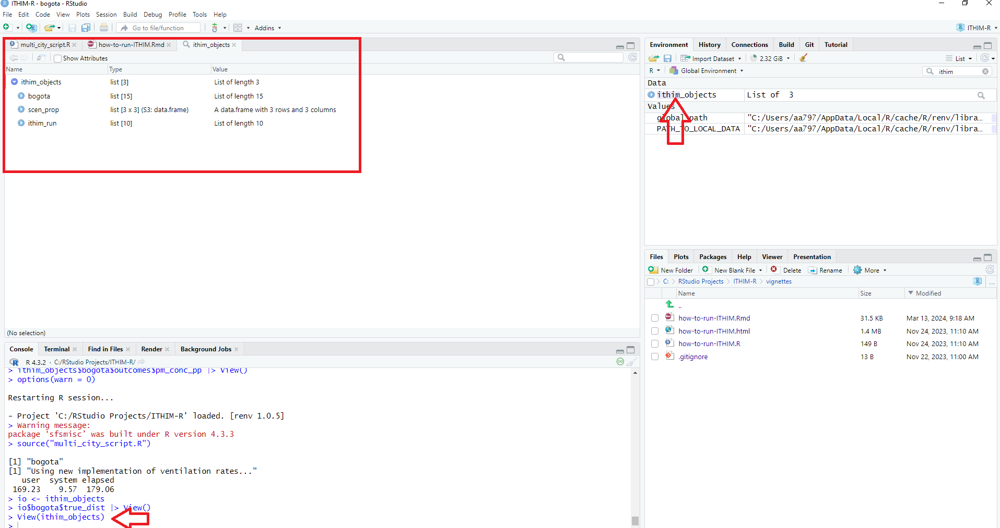
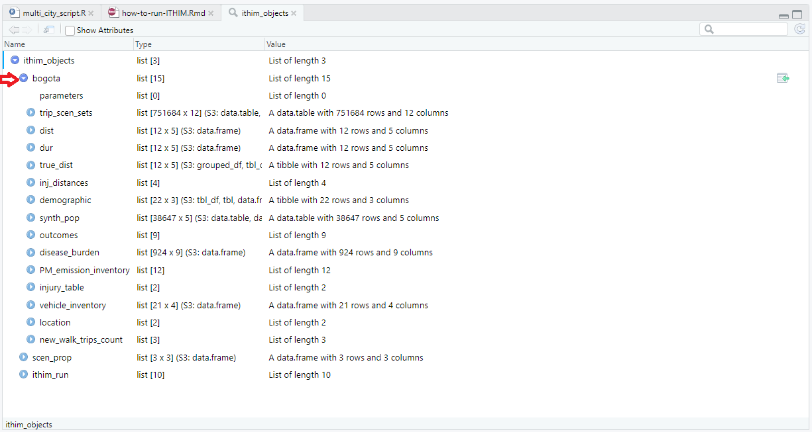

# Learning objectives:

-   Simulation of individual level Physical Activity (PA) from travel and non-travel domain in baseline and scenarios.
-   Derive a synthetic population with reference PA and show summary statistics.

Before we get into exercises, let's explore how this works. We will start off with an example Q&A below:

## Setting up question and answers

Fill in the blank so that the result of the **sum** is *10*. Replace the `_` with the right number.

```{r}
1 + 2 + 3 + _
```

On the first day, you would have run the model and saved the outputs in the `ithim object` - which we called `io` as short. We have read it in the background and can access it throughout these exercises.

A closer look at the `ithim` object.

## A close look at the ithim_objects (io)

The ithim_objects list is saved under *results/multi_city/io.rds*, and it is generated when `multi_city_script.R` is executed.

You may view it using the command `View(ithim_objects)` and it will then show you its content as such:

{width="100%"}

You may click on individual sub-items such as `bogota` for more information.

{width="100%"}

This list contains a comprehensive set of intermediate and final results from the model run:

For each city modelled, which is in this case is `bogota`, it contains the following data:

-   **trip_scen_sets**: trip data for all scenarios for the baseline population, i.e. the population sample built by the synthetic travel diary population.

-   **dist**: total stage mode distances for each mode and scenario (including baseline) for the baseline population.

-   **dur**: total stage mode duration for each mode and scenario (including baseline) for the baseline population.

-   **true_dist**: distances from the trip data scaled up to the total distance travelled by the baseline population of the city (for age ranges considered in the model only) for each scenario (including baseline) and mode of transport.

-   **demographic**: city population counts for all age categories and sex combinations considered in the model.

-   **base_pop**: population extracted from the physical activity survey assigning non-transport, non-occupational PA component of physical activity values in mMETs hours per person per week.

-   **outcomes**:

    -   **mmets**: Marginal MET values for each person in the baseline population for each scenario.

    -   **pm_conc_pp**: PM2.5 exposures attributed to each person in the baseline population for each scenario (including baseline).

    -   **co2_emission_inventory**: total CO2 emission levels for each mode of transport and scenario (including baseline).

    -   **hb**: health burden (deaths and years of life lost (YLL) in two separate data frames) for each age and sex category and each health outcome using the combined result for health outcomes impacted by both air pollution and physical activity levels.

    -   **pathway_hb**: health burden (deaths and years of life lost (YLL) in two separate data frames) for each age and sex category and each health outcome keeping the results for health outcomes impacted by both air pollution and physical activity levels separate.

-   **disease_burden**: health outcome burden for all health outcomes for the baseline scenario (deaths and years of life lost) for all age and sex categories considered in the model (from input data).

-   **PM_emission_inventory**: PM emission inventory by mode of transport for the baseline scenario (from input data).

-   **vehicle_inventory**: gives the speed and CO2 and PM2.5 emissions inventories for all vehicles in the baseline scenario.

-   **location**: country and continent information.

-   **new_walk_trips_count**: number of rail and bus trips to which an additional walking stage was added during the model run.

**scen_prop**:

-   the proportion of trips by mode to be converted for each distance category and scenario.

**Ithim_run**:

-   information about the ITHIM-R run such as the name of the input parameters file, the name of the scenario definition used, the baseline scenario, the scenario names, the computation mode (constant or sample), the timestamp of the model run, the output version number, the author of the model run and any additional comments about this particular model run.

### ITHIM Object (io)

Investigate the structure of the `io` object. Use the `names` function. If you need more information about it, please write `?names()` on your console.

```{r setup}
#| echo: false
#| warning: false
#| eval: true
#| message: false
library(tidyverse)
library(here)
CYCLING_MMET <- 5.8
WALKING_MMET <- 2.5
io <- readRDS(here("results/multi_city/io.rds"))

```

```{r}
_(io)
```

Hint: Consider using the `names()` function {.hidden-heading style="color:gray"}

# Now look at Bogota specific list called `bogota`

Similar to the io object (which is a list), let's investigate the structure of the `bogota` list stored within the `io` object. Use the previously learnt knowledge to explore it.

```{r}
_(io$bogota)
```

## Show the first few rows of the base population object

The base population object of the is stored in the `base_pop` object

```{r}
names(io$bogota$_)
```

## Create a summary of background PA by age and sex groups

Note that the `age` column is a continuous variable, whereas `age_cat` is a 5 year age group.

```{r}
io$bogota$base_pop |> 
  group_by(_, _) |> 
  reframe(mean_background_LTPA = 
            mean(work_ltpa_marg_met))
```

## See if males and females have the same background PA

Using `sex` column, we are interested in calculating `mean` value of the column `work_ltpa_marg_met` below. Broadly speaking men have higher levels of PA than women in all domains.

```{r}
io$bogota$base_pop |> 
  ungroup() |> 
  group_by(_) |> 
  reframe(mean_background_LTPA = 
            mean(work_ltpa_marg_met))
```

## Read in the total PA volume for each participant

Let's read in the data frame called `mmets` that stores total PA volume (background and travel related) in mMET hours per week from the `io` object. Once read in, let's look at the structure of it:

```{r}
mmets <- io$bogota$outcomes$_
head(mmets)
```

# Travel related PA volume

## Read the `trip` dataset from the `io` object

Just to remind you the trip dataset is stored as `trip_scens_sets` and it contains travel bahaviour of baseline and all the scenarios.

```{r}
trips <- io$bogota$_
head(trips)
```

## Look at the columns of trips dataset

You can either use `names()` or `head()` function for this purpose.

```{r}
_(trips)
```

Trip dataset contains both `trip` related information such as travel mode, distance as well as the person doing that trip with their ID captured in the `participant_id` and other demographics such as `age` and `sex`.

## Calculate duration per person for active travel modes (cycling and walking)

Using trips dataset, do the following to calculate time spent (duration) per person doing cycling and walking by following these steps:

-   But before that, we need to identify which modes contain active travels. They are: `cycle`, `pedestrian` and `walk_to_pt` (walking component of to and from the bus stops).

-   Rename short walks (`walk_to_pt`) to `pedestrian` mode

-   Sum duration by each active mode for each person.

```{r}
active_travel_duration <- io$bogota$trip_scen_sets |> 
  # Remove ghost trips - (bus and car vehicles)
  filter(participant_id > 0) |> 
  mutate(
      # Rename walk_to_pt to pedestrian
      stage_mode = case_when(grepl("walk_to_pt", stage_mode) ~ 
                                  "pedestrian", TRUE ~ stage_mode), 
      # Chage stage_duration in minutes to hours            
      stage_duration = stage_duration / 60) |> 
  # Group by participant_id for each scenario
  group_by(participant_id, scenario) |> 
  # Calculate overall duration per person per week spent in active travel
  reframe(dur_cyc_hrs = sum(stage_duration[stage_mode == "_"]),
          dur_ped_hrs = sum(stage_duration[stage_mode == "_"]))
# Show top rows
head(active_travel_duration)
```

## Calculate mMET hours per week from time spent in active travel

In order to calculate the total travel related PA for each person, we need to use the following function: weekly duration in hours \* mMET hours per week. For cycling, mMET hours per week is `5.8` and for walking, it is `2.5`. In order to have a combined travel related mMET hours per week, we sum PA volume for `cycling` and `walking` together.

```{r}
travel_mmets <- 
  # Use active travel duration per person dataset
  active_travel_duration |> 
  # Group by participant_id and scenario
  group_by(participant_id, scenario) |> 
  reframe(total_travel_mmets = _ * (CYCLING_MMET) + 
            _ * (WALKING_MMET)) 

head(travel_mmets)
```

## Bring travel and non travel related PA together

Now that we have calculated travel related PA (in mMET hours per week) for each individual in the previous exercise. In this one, we'd like to bring in both the travel and the background PA together. Just to remind you that the background PA (again in the same unit as mMET hours per week) is stored in in the `io$bogota$base_pop` object.

```{r}
mmets_pp <- travel_mmets |> 
  ## join it with participant id and bring the `work_ltpa_marg_met` column
  ## the stores background PA for each individual
  left_join(io$bogota$base_pop |> dplyr::select(participant_id, _))

head(mmets_pp)
```

## Add travel and non-travel PA together

Sum background PA (which doesn't change throughout) and the travel PA (which does change in scenarios from baseline) to calculate overall PA volume for each person in a week.

```{r}
mmets_pp_total <- mmets_pp |> 
  mutate(total_mmets = _ + _)

head(mmets_pp_total)
```

## Change the layout `mmets_pp_total` to wide

Change the layout of the PA volume per person per scenario

```{r}
mmets_pp_total_wide <- mmets_pp_total |> 
  # Remove columns that we are not interested in
  dplyr::select(-c(total_travel_mmets, work_ltpa_marg_met)) |> 
  # Take values from scenario and the variable that holds total mmets
  pivot_wider(names_from = _, values_from = _)

head(mmets_pp_total_wide)

```

## Compare summary statistics of modelled output

In this section we look at statistics that the model generated with the one we generated above. In order the compare the two, we need to account for *only* those participants that have travel information, so it means to filter those ids that exist in both travel and background datasets. Fill in the blank to filter participant id column.

```{r}

# Keep only those participants that have travel behaviours captured in the `trip_scen_sets`
mmets <- mmets |> filter(_ %in% mmets_pp_total_wide$participant_id)

head(mmets)
```
