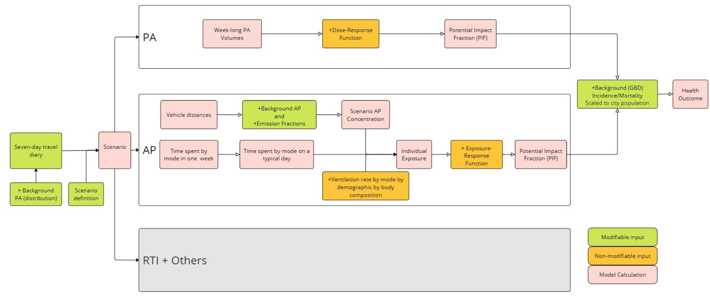

## Agenda

# Agenda

-   Why global version 2?

-   Structure of the model

    -   Inputs datasets

    -   Parameters

-   What are the main ingredients?

    -   Physical Activity

    -   Air Pollution

-   Shiny Interface

    -   Travel behaviours

    -   PA and AP exposures

    -   Health Outcomes

# Why ITHIM Global V2?

```{r}
#| echo: false
# Load the package
library(ithimr)
# and other useful ones
library(tidyverse)
# gt
library(gt)


if (!exists("output_version")){
  ## Get the current repo sha
  gitArgs <- c("rev-parse", "--short", "HEAD", ">", file.path("repo_sha"))
  # Use shell command for Windows as it's failing with system2 for Windows (giving status 128)
  if (.Platform$OS.type == "windows"){
    shell(paste(append("git", gitArgs), collapse = " "), wait = T)
  } else {
    system2("git", gitArgs, wait = T)
  }
  
  repo_sha <-  as.character(readLines(file.path("repo_sha")))
  output_version <- repo_sha
}

#io <- readRDS(paste0("../results/multi_city/io_", output_version, ".rds"))
io <- readRDS(paste0("../results/multi_city/io_48d87be.rds"))

all_cause_ap <- read_csv("../inst/extdata/global/dose_response/drap/extdata/all_cause_ap.csv")

city <- 'bogota'

```

## Issues with travel surveys

-   One day travel surveys are of poor quality with:

    -   Missing modes

    -   Missing trips

-   Under-reporting of short trips, such as walking trips (non-work related trips in general)

-   Sample size limitations

-   Requirement: a week-long representative travel behaviour dataset that tackles such issues

## Synthetic travel behaviour dataset \[By Ismail\]

-   **Generate weekly trips per person**\
    Using statistical models and National Travel Survey (NTS) England 7-day data, weekly trip frequency per person is calculated based on age, gender, and occupation status.

-   **Assign travel times to trips**\
    Using a regression model, based on one-day travel survey data from 27 Latin, African and Indian cities, assign trip duration based on age, gender, city-level attributes (population, GDP, size), travel mode shares, and network indicators (elevation, street lengths)

-   **Predict trip mode via classification model**\
    Lastly, using a classification model based on the same set of variables mentioned earlier, plus trip duration, predict trip mode

## Model Structure



## Synethtic Trip Dataset (1/2)

A modelled week long synthetic trip dataset in which each row represents a trip with:

-   **Individual-level variables**

    -   **participant_id**: unique ID for each individual
    -   **age**: participant's age as an integer
    -   **sex**: male or female

-   **Trip-level variables:**

    -   **trip_id**: unique ID for each trip made by each individual
    -   **trip_mode**: main mode of the trip
    -   **trip_distance**: total trip distance in kilometers

## Trip dataset (2/2)

-   **Stage-level variables:**
    -   **stage_mode**: Mode of the trip stage
    -   **stage_duration**: Duration of each stage in minutes

```{r}
#| echo: false
#| results: asis

#
# io[[city]]$trip_scen_sets |> filter(scenario == "baseline") |> dplyr::select(-c(scenario, ends_with("cat"))) |> arrange(trip_id) |> head() |> knitr::kable() |> kableExtra::landscape()

io[[city]]$trip_scen_sets |> filter(scenario == "baseline") |> dplyr::select(-c(scenario, ends_with("cat"))) |> arrange(trip_id) |> head() |> gt(caption = "Trip dataset with demographics and trip details") |> gt::as_raw_html()

```

## Base population with PA Dataset

Based on the individuals in the synthetic trip dataset, we create a dataset that identifies all participants with their demographics and assigns a background weekly leisure PA to each participant based on a distribution

-   **Base population with PA**

    -   **participant_id**: unique person ID (integer)
    -   **age**: numeric age
    -   **sex**: male or female
    -   **ltpa_marg_met:** leisure-time (non-transport) physical activity in marginal metabolic equivalent task hours (mMET-hrs) per week

```{r, results='asis'}
#| echo: false
io[[city]]$base_pop |> arrange(participant_id) |> rename(ltpa_marg_met = work_ltpa_marg_met) |> arrange(participant_id) |> head() |> gt(caption = "Base population with background PA in mMET-hrs per week") |> gt::as_raw_html()
```

## Burden of Disease (BoD) dataset (1/2)

Cause specific disease burden data from Institute for Health Metrics and Evaluation **IHME's** global burden of disease database (<https://ghdx.healthdata.org/gbd-2019>)

-   **Burden data**

    -   **measure**: Deaths or Years of Life Lost (YLLs)
    -   **age**: age group - usually a five year band as integer
    -   **cause**: cause/disease (*details later on*)
    -   **population**: population size by age and gender group
    -   **mix_age**: minimum age in integer for the current age and gender group
    -   **max_age**: maximum age in integer for the current age and gender group
    -   **rate**: rate of risk of measure per person
    -   **burden**: burden of the measure for the *population*

## Burden of Disease (BoD) dataset (2/2)

```{r, results='asis'}
#| echo: false
io[[city]]$disease_burden |> head() |> gt(caption = "Burden of Disease dataset") |> gt::as_raw_html()
```

## Population Dataset

The demographic information is by age and gender. This also comes from **IHME's** global burden of disease database (<https://ghdx.healthdata.org/gbd-2019>)

-   **Population**

    -   **sex**: male or female
    -   **age**: age group - usually a five year band as integer
    -   **population**: population size

```{r, results='asis'}
#| echo: false
io[[city]]$demographic |> head() |> gt(caption = "Population dataset with sex and age groups") |> gt::as_raw_html()
```

## Parameters


# What are the main ingredients?

## Physical activity

-   Travel related comes from active travel (cycling and walking)
-   Background PA comes from baseline population

## Non-linear dose-response curve


## PA dose-response

```{r}
#| eval: true 
#| echo: false
#| results: asis

RRs <- (drpa::dose_response(cause = "all-cause-mortality", outcome_type = "fatal", 
                          dose = c(0, 5, 10))$rr)
Doses <- c(0, 5, 10)

df <- data.frame(Doses, RRs) |> mutate_if(is.numeric, round, 2) |> 
  gt(caption = "PA dose-response relationship for all-cause-mortality") |> gt::as_raw_html()


```

## Potential Impact Fraction

$$
pif = (RRbase - RRscenario)/RRbase
$$

```{r}
#| eval: true 
#| echo: false

calculate_pa_pif <- function(base_dose, scen_dose){
  
  rr_base <- drpa::dose_response(cause = "all-cause-mortality", outcome_type = "fatal", dose = base_dose)$rr
  
  rr_scen <- drpa::dose_response(cause = "all-cause-mortality", outcome_type = "fatal", dose = scen_dose)$rr
  
  return((rr_base - rr_scen)/rr_base)
}

calculate_ap_pif <- function(base_dose, scen_dose){
  
  rr_base <- ithimr::AP_dose_response(cause = "all_cause_ap", dose = base_dose, quantile = 0.5)$rr
  
  rr_scen <- ithimr::AP_dose_response(cause = "all_cause_ap", dose = scen_dose, quantile = 0.5)$rr
  
  return((rr_base - rr_scen)/rr_base)
}


```

PIF with baseline PA volume (5) and scenario PA volume 10

```{r}
#| eval: true 
#| code-line-numbers: "|1|2"
#| echo: false

pa_pif <- calculate_pa_pif(base_dose = 5, scen_dose = 10)
print(round(pa_pif, 2))

```

PIF with baseline PA volume (10) and scenario PA volume (15)

```{r}
#| eval: true 
#| code-line-numbers: "|1|2"
#| echo: false

pa_pif <- calculate_pa_pif(base_dose = 10, scen_dose = 15)
print(round(pa_pif, 2))

```

## Air Pollution

Personal exposure of PM2.5 is calculated based on:

-   mode specific exposures, such as more exposed while cycling than travelling in a car

-   ventilation rates (based on BMI)

-   time spent in travel mode

-   time spent during rest of the day in activities (such as sleeping, resting and doing light and vigorous physical activities)

$$
PM2.5Inhaled = TravelModeDuration * VentilationRate * ModeSpecificExposureRates * PM2.5Concentration
$$

## AP dose-response (exposure response)

```{r}
#| eval: true 
#| echo: false
#| results: asis

RRs <-  ithimr::AP_dose_response(cause = "all_cause_ap", dose = c(0, 5, 10), quantile = 0.5)$rr
                          
Doses <- c(0, 5, 10)

df <- data.frame(Doses, RRs) |> mutate_if(is.numeric, round, 2)

df |> gt(caption = "Doses (exposures) and their relative risk for all cause mortality for PM2.5") |> gt::as_raw_html()


```

## Potential Impact Fraction

$$
pif = (RRbase - RRscenario)/RRbase
$$

PIF with baseline AP (PM 2.5) exposure of (5) and scenario AP exposure of 10

```{r}
#| eval: true 
#| code-line-numbers: "|1|2"
#| echo: false

#-0.03923048
ap_pif2 <- calculate_ap_pif(base_dose = 5, scen_dose = 10)
print(round(ap_pif2, 2))

```

PIF with baseline AP (PM 2.5) exposure of (10) and scenario AP exposure of 5

```{r}
#| eval: true 
#| code-line-numbers: "|1|2"
#| echo: false

ap_pif2 <- calculate_ap_pif(base_dose = 10, scen_dose = 15)
print(round(ap_pif2, 2))

```
