```{r}
library(tidyverse)
library(kableExtra)
library(modelsummary)
library(fixest)
library(gt)
library(gtExtras)
library(gghighlight)
library(gridExtra)
library(quartomonothemer)
library(showtext)

theme_set(theme_minimal())
```

```{r}
font_title <- "Josefin Sans"
font_text <- "Montserrat"
font_sans <- "Noto Sans" 
color_base <- "#009F8C"
color_base_light <- "#95DFD6"
color_accent <- "#B75C9D"
color_accent_light <- "#DBA6CC"
gray <- "#bebebe"
darkgray <- "#6d6d6d"

font_add_google(font_title)
font_add_google(font_text)
showtext_auto()

style_mono_quarto(
  font_title = font_title,
  font_text = font_text,
  font_sans = font_sans,
  color_base = color_base,
  color_accent = color_accent,
  color_link = color_accent,
  color_code = color_base,
  size_base = 30,
  path_scss = here::here("quartomonothemer.scss")
)
```

```{r}
# function to convert scenario names
get_qualified_scen_name <- function(cs){
  qualified_scen_name <- ""
  if (cs == 'base' | cs == 'Baseline' | cs == 'baseline')
    qualified_scen_name <- 'Baseline'
  else if(cs == "sc_walk")
    qualified_scen_name <- 'Walking'
  else if(cs == "sc_cycle")
    qualified_scen_name <- 'Cycling'
  else if(cs == "sc_car")
    qualified_scen_name <- 'Car'
  else if(cs == "sc_motorcycle")
    qualified_scen_name <- 'Motorcycling'
  else if(cs == "sc_bus")
    qualified_scen_name <- 'Bus'
  
  return(qualified_scen_name)
}

```

```{r}

library(tidyverse)
library(plotly)

library(here)
library(tidyverse)
library(gghighlight)
library(gt)
library(gtExtras)

repo_sha <-  as.character(readLines(file.path("../repo_sha")))
io <- readRDS(paste0("../results/multi_city/io_", repo_sha, "_test_run.rds"))
city <- 'bogota'
# PIF <- read_csv("data/PIF.csv")
# 
# PIF <- PIF |> rename(Scenario = name) |> mutate(Scenario = case_when(
#                  Scenario  == "sc_cycle_PIF" ~ "Bicycling",
#                  Scenario  == "sc_car_PIF" ~ "Car",
#                  Scenario  == "sc_bus_PIF" ~ "Public Transport",
#                )
# )

# prop <- io$bogota$trip_scen_sets |> filter(participant_id !=0) |> distinct(scenario, trip_id, .keep_all = T) |> count(scenario, trip_mode) |> mutate(freq = round(prop.table(n) * 100, 1), .by = scenario) |> mutate(pd = round(freq - freq[scenario == 'baseline'], 1)) |> filter(pd != 0)

# Calculate proportions by mode when compared with baseline
  total_trips <- io[[city]]$trip_scen_sets |> filter(scenario == "baseline") |> 
    distinct(trip_id, scenario, .keep_all = T) |> nrow()

prop <- io[[city]]$trip_scen_sets |> 
    filter(participant_id !=0) |> 
    distinct(trip_id, scenario, .keep_all = T) |> 
    group_by(scenario, trip_mode) |> 
    reframe(freq = round(sum(dplyr::n())/total_trips*100, 1)) |> 
    mutate(pd = freq - freq[scenario == 'baseline']) |> 
    filter(pd != 0)

prop[prop$scenario == "baseline",]$scenario <- "Baseline"
prop[prop$scenario == "sc_bus",]$scenario <- "Bus"
prop[prop$scenario == "sc_car",]$scenario <- "Car"
prop[prop$scenario == "sc_cycle",]$scenario <- "Cycling"

scen_colours <- c("Baseline" = '#b15928',
                  "Cycling" = '#abdda4',
                  "Car" = '#d7191c',
                  "Bus" = '#2b83ba',
                  "Motorcycle" = '#fdae61')


```

# Scenario Definition - (5% change)

<!-- ## Scenario Proportions -->

<!-- 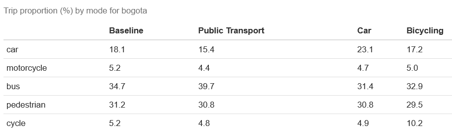 -->

<!-- ## Cycling Scenario -->

<!-- 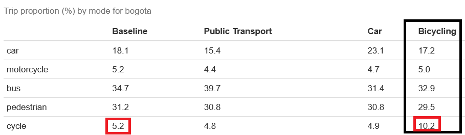 -->

<!-- ## Bus Scenario -->

<!-- 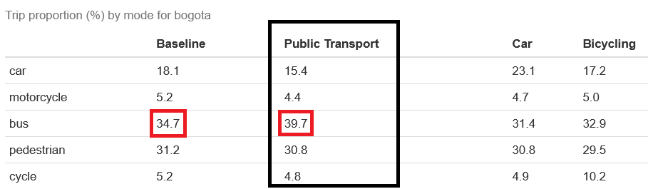 -->

<!-- ## Car Scenario -->

<!-- 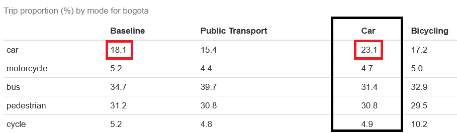 -->

## Comparison

```{r}

plotly::ggplotly(ggplot(prop) +
     aes(x = trip_mode, fill = scenario, weight = pd) +
     geom_bar() +
     scale_fill_hue(direction = 1) +
    scale_x_discrete(guide = guide_axis(angle = 90)) + 
    geom_text(aes(x = trip_mode, y = round(pd, 1), label = round(pd, 1)), size = 4, 
                                 position = position_dodge()) + scale_fill_manual(values = scen_colours) +
     facet_wrap(vars(scenario)) + 
     labs(title = "Scenario definition (by mode)", y = "Percentage (%)", x = "Trip Mode") + theme(axis.text.x = element_text(angle = 90, vjust = 0.5, hjust=1)))

```

<!-- ## Comparison by distance change -->

<!-- ```{r} -->

<!-- # modes_to_ignore <- io$bogota$trip_scen_sets |> filter(participant_id == 0 & trip_mode != 'motorcycle') |> distinct(trip_mode) |> pull() -->

<!-- prop_dist <- io$bogota$dist |>  -->
<!--   # filter(!stage_mode %in% c("truck", "bus_driver", "car_driver")) |> -->
<!--   mutate_if(is.numeric, ~ round(. / sum(.) * 100, 1)) |>  -->
<!--   mutate(sc_bus = sc_bus - baseline, sc_car = sc_car - baseline, sc_cycle = sc_cycle - baseline) |> -->
<!--   filter(stage_mode %in% c("bus", "car", "cycle", "motorcycle", "pedestrian")) |>  -->
<!--   dplyr::select(-baseline) |>  -->
<!--   rename("Bicycling" = sc_cycle, "Car" = sc_car, "Public Transport" = sc_bus, "mode" = stage_mode) |> -->
<!--   pivot_longer(cols = -c(mode), names_to = "scenario") -->

<!-- scen_colours <- c("Baseline" = '#ffffbf', -->
<!--                   "Bicycling" = '#abdda4', -->
<!--                   "Car" = '#d7191c', -->
<!--                   "Public Transport" = '#2b83ba', -->
<!--                   "Motorcycle" = '#fdae61') -->


<!-- plotly::ggplotly(ggplot(prop_dist) + -->
<!--      aes(x = mode, fill = scenario, weight = value) + -->
<!--      geom_bar() + -->
<!--      scale_fill_hue(direction = 1) + -->
<!--     scale_x_discrete(guide = guide_axis(angle = 90)) +  -->
<!--     geom_text(aes(x = mode, y = round(value, 1), label = round(value, 1)), size = 4,  -->
<!--                                  position = position_dodge()) + scale_fill_manual(values = scen_colours) + -->
<!--      facet_wrap(vars(scenario)) +  -->
<!--      labs(title = "Scenario definition (by mode) by distance", y = "Proportional change (%) when compared with baseline", x = "Trip Mode") + theme(axis.text.x = element_text(angle = 90, vjust = 0.5, hjust=1))) -->


<!-- ``` -->

<!-- # Comparision by proportional change in distance -->

<!-- ```{r} -->

<!-- prop_dist <- io$bogota$dist |>  -->
<!--   mutate(across(starts_with("sc"), ~ (round((. - baseline)/., 3)))) |> -->
<!--   filter(!stage_mode %in% c("truck", "car_driver", "bus_driver", "taxi", "auto_rickshaw", "rail")) |>  -->
<!--   dplyr::select(-baseline) |>  -->
<!--   rename("Bicycling" = sc_cycle, "Car" = sc_car, "Public Transport" = sc_bus, "mode" = stage_mode) |> -->
<!--   pivot_longer(cols = -c(mode), names_to = "scenario") -->

<!-- scen_colours <- c("Baseline" = '#ffffbf', -->
<!--                   "Bicycling" = '#abdda4', -->
<!--                   "Car" = '#d7191c', -->
<!--                   "Public Transport" = '#2b83ba', -->
<!--                   "Motorcycle" = '#fdae61') -->


<!-- plotly::ggplotly(ggplot(prop_dist) + -->
<!--      aes(x = mode, fill = scenario, weight = value) + -->
<!--      geom_bar() + -->
<!--      scale_fill_hue(direction = 1) + -->
<!--     scale_x_discrete(guide = guide_axis(angle = 90)) +  -->
<!--     geom_text(aes(x = mode, y = round(value, 1), label = round(value, 1)), size = 4,  -->
<!--                                  position = position_dodge()) + scale_fill_manual(values = scen_colours) + -->
<!--      facet_wrap(vars(scenario)) +  -->
<!--      labs(title = "Scenario definition (by mode) by distance", y = "Proportion change (%) from baseline", x = "Trip Mode") + theme(axis.text.x = element_text(angle = 90, vjust = 0.5, hjust=1))) -->


<!-- ``` -->

<!-- # Distance tables - (km) -->

<!-- ## Distance table -->

<!-- 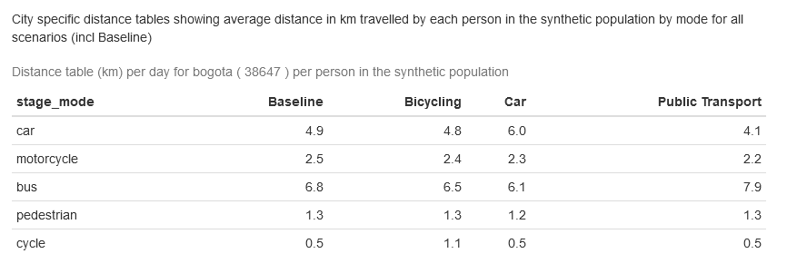 -->

<!-- ## Cycling Scenario distance table -->

<!-- 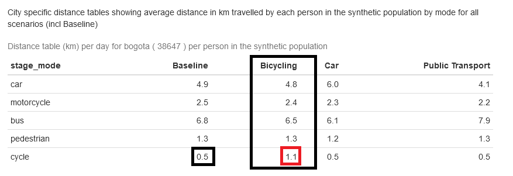 -->

<!-- ## Bus Scenario distance table -->

<!-- 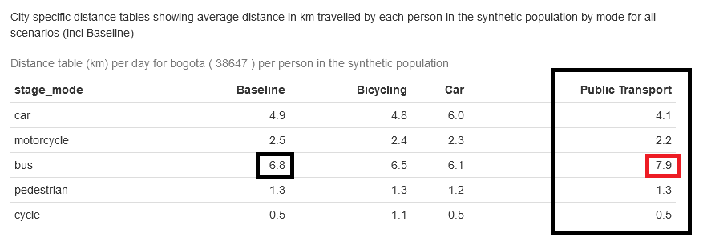 -->

<!-- ## Car Scenario distance table -->

<!-- 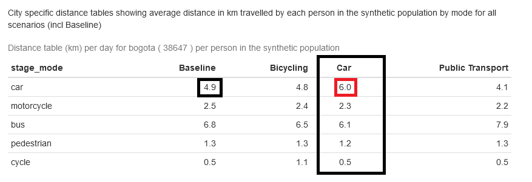 -->

<!-- # Duration tables - (minutes) -->

<!-- ## Duration table -->

<!-- 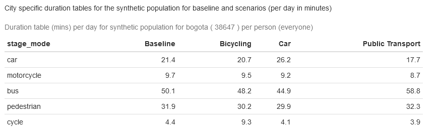 -->

<!-- ## Cycling Scenario duration table -->

<!-- 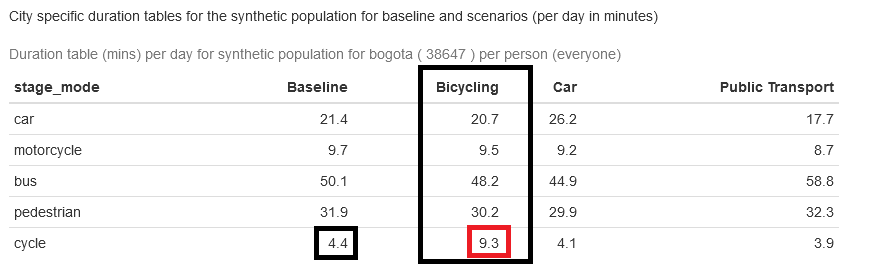 -->

<!-- ## Bus Scenario duration table -->

<!-- 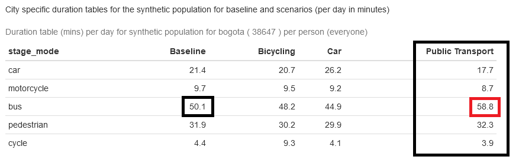 -->

<!-- ## Car Scenario duration table -->

<!-- 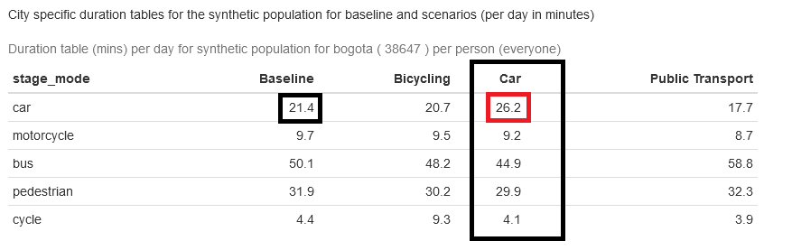 -->

## ITHIM Overview

### Structure

#### Figure

#### Pathways

## Outcomes

<!-- ## Duration table -->

<!--  -->

## EDGAR emissions of PM2.5 by modes

```{r fig.height=5, fig.width=8}

gtb <- io$bogota$vehicle_inventory |> 
  dplyr::select(-c(speed, CO2_emission_inventory)) |> 
  filter(PM_emission_inventory !=0) |> 
  mutate(PM_emission_inventory = round(PM_emission_inventory * 100, 1)) |> 
  gt() |> 
  cols_label(stage_mode = "Mode", PM_emission_inventory = "PM Emission Inventory") |>
  gt_plt_bar_pct(PM_emission_inventory, scaled = TRUE, labels = TRUE)

gtb
```

## PA outcomes - Marginal METs per person per week

# Comparison of baseline and bus scenaro

```{r mmets_dist_bus}

mmets <- io$bogota$outcomes$mmets #|> pivot_longer(cols = ends_with("mmet"))

change_names <- which(grepl("_mmet", names(mmets), fixed = TRUE))
  names(mmets)[change_names] <- sapply(gsub("_mmet" , "", names(mmets)[change_names]), FUN = get_qualified_scen_name)

mmets <- mmets |> pivot_longer(cols = -c(1:4)) |> rename(Scenario = name)
  
mmets_df <- mmets |> filter(Scenario %in% c("Baseline", "Bus"))

plotly::ggplotly(ggplot(mmets_df, aes(x=value, fill=Scenario)) + 
                   geom_density(alpha=.3) + 
                   scale_fill_manual(values = scen_colours[1:4]) +
                   xlim(0, 30) +
                   geom_vline(xintercept = 17.5, linetype="dashed", color = "red") +
                   labs(title = "Cumulative Distribution of MMETs per person per week (Baseline versus Bus scenario)",
                        x = "MMETs per person per week",
                        y = "Density")
                   )

```


# Comparison of baseline and cycling scenario

```{r mmets_dist_cycling}

mmets_df <- mmets |> filter(Scenario %in% c("Baseline", "Cycling"))

plotly::ggplotly(ggplot(mmets_df, aes(x=value, fill=Scenario)) + 
                   geom_density(alpha=.3) + 
                   scale_fill_manual(values = scen_colours[1:2]) +
                   xlim(0, 30) +
                   geom_vline(xintercept = 17.5, linetype="dashed", color = "red") +
                   labs(title = "Cumulative Distribution of MMETs per person per week (Baseline versus Cycling scenario)",
                        x = "MMETs per person per week",
                        y = "Density")
                   )

```


## AP Outcomes - PM2.5 exposure levels ($\mu$/$m^3$)

```{r}
mmets |> 
    group_by(Scenario) |> 
    reframe(qs = c(quantile(value, prob = 0.25), median(value), mean(value))) |>
    mutate(qs = round(qs, 1)) |> group_by(Scenario) |> summarise(ld = list(qs)) |> gt() |> gt_plt_bar_stack(column = ld, labels = c("Minimum", "Median", "Mean"), palette = c("#fee8c8", "#fdbb84", "#e34a33"))


```

```{r}


print_pif_table <- function(mmets, censor_method = "WHO-QRL", plot_tile = ""){
  
  rr <- mmets |> mutate(across(ends_with("mmet"), ~ drpa::dose_response(
    cause = "all-cause-mortality", outcome_type = "fatal",
    dose = .x, censor_method = censor_method) |> pull())) |> 
    dplyr::select(ends_with("mmet")) |> 
    rename_with(~ gsub("mmet", "rr", .x, fixed = TRUE))
  
  pif <- cbind(mmets, rr) |> 
    dplyr::select(ends_with("_rr"), age_cat, sex) |> 
    group_by (age_cat, sex) |> 
    summarise(across(where(is.numeric), sum)) |> 
    mutate(pif_cyc = ((base_rr - sc_cycle_rr)/base_rr), 
           pif_bus = ((base_rr - sc_bus_rr)/base_rr)) |> 
    dplyr::select(age_cat, sex, contains("pif")) |> 
    pivot_longer(cols = -c(age_cat, sex)) |> rename(Scenario = name)
  
  pif$Scenario[pif$Scenario == "pif_cyc"] <- "Cycling"
  pif$Scenario[pif$Scenario == "pif_bus"] <- "Bus"
  
  total_pif <- reframe(pif |> ungroup(), mean = round(sum(value), 2), .by = Scenario) |> rename(`Total PIF` = mean)
  
  total_pif$Scenario[total_pif$Scenario == "pif_cyc"] <- "Cycling"
  total_pif$Scenario[total_pif$Scenario == "pif_bus"] <- "Bus"
  
  y <- ggplot(pif) +
          aes(x = value, y = Scenario, fill = Scenario) +
          geom_boxplot() +
          scale_fill_hue(direction = 1) +
          scale_fill_manual(values = scen_colours) +
          theme_minimal() +
          labs(title = plot_tile, x = "PIF (%)", y = "Scenario") +
          annotation_custom(tableGrob(total_pif, rows=NULL), 
                            xmin=0.025, ymin="Bus")
  
  print(y)
  
  fname <- "pif_w_censor_point_none"
  if (censor_method == "WHO-QRL")
    fname <- "pif_w_censor_point_35mmets"
  else if(censor_method == "WHO-DRL")
    fname <- "pif_w_censor_point_17.5mmets"
  
  ggsave(paste0("../figures/", fname, ".svg"), plot = y, width=10, height=8)
  
  
  return(pif)
  #print(reframe(pif |> ungroup(), sum(value), .by = name))
}


# print_pif_table(mmets, censor_method = "WHO-DRL", plot_tile = "PIF for cycling/public transport with censor point at 17.5 MMET hours per week")
# 
# print_pif_table(mmets, censor_method = "WHO-QRL", plot_tile = "PIF for cycling/public transport with censor point at 35 MMET hours per week")


```

## Potential Impact Fraction at 17.5 MMET hours per week

```{r}

pif_175 <-print_pif_table(io$bogota$outcomes$mmets, censor_method = "WHO-DRL", plot_tile = "")

```

## Potential Impact Fraction at 35 MMET hours per week

```{r}

print_pif_table(io$bogota$outcomes$mmets, censor_method = "WHO-QRL", plot_tile = "")

```

## Potential Impact Fraction using different censor points

```{r}

print_pif_table(io$bogota$outcomes$mmets, censor_method = "none", plot_tile = "")

```

## Decile MMETs hours per week

```{r}

df_deciles <- mmets  |> 
  group_by(Scenario) |> 
  summarise(q = list(quantile(value, probs = seq(0, 0.9, by = 0.1) ))) |> 
  unnest_wider(q) |> 
  pivot_longer(cols = contains("%"), names_to = "decile", values_to = "value")

y <- ggplot(df_deciles, aes(x = decile, y = value, color = Scenario)) +
  geom_line(aes(group = Scenario)) +
  geom_point() +
  labs(title = "", x = "Deciles (0 - 0.9)", y = "mMET-hours/week") +
  geom_hline(yintercept = 17.5, linetype="dashed", color = "red") +
  # geom_hline(yintercept = 17.5 * 2, linetype="dashed", color = "red") +
  theme_minimal()

# Plot deciles by scenario
plotly::ggplotly(y)
```

## PIF on deciles

```{r echo=F, message=FALSE}
pif_deciles <- df_deciles |> pivot_wider(id_cols = decile, names_from = Scenario, values_from = value) |> mutate(across(2:5, ~ drpa::dose_response(dose = ., cause = "all-cause-mortality", outcome_type = "fatal")$rr)) |> mutate(across(2:5, ~ ifelse(. != 0, ((Baseline - .)/Baseline) * 100, 0))) |> dplyr::select(-Baseline) |> pivot_longer(cols = -c(decile)) |> rename(Scenario = name)

y <- ggplot(pif_deciles) +
    aes(x = decile, y = value, fill = Scenario) +
    geom_bar(stat = "identity", position = "dodge", width = 0.5) +
    scale_fill_manual(values = scen_colours) +
    labs(x = "Deciles (0-0.9)", y = "PIF (%)", title = "")
    theme_minimal()
    
  ggsave(paste0("../figures/", "pa_RR_prop_diff_base.svg"), plot = y, width=10, height=8)


plotly::ggplotly(y)

```

<!-- ```{r} -->

<!-- ggplotly(ggplot(PIF) + -->

<!--   aes(x = group, y = value, fill = Scenario) + -->

<!--   geom_boxplot() + -->

<!--   scale_fill_hue(direction = 1) + -->

<!--   theme(axis.text.x = element_text(angle = 90, vjust = 0.5, hjust=1)) + -->

<!--   scale_fill_manual(values = scen_colours) + -->

<!--   facet_wrap(vars(Scenario)) + -->

<!--   labs("Potential Impact Fraction using all-cause DRF", -->

<!--   subtitle = "We have used three different DRFs where censor point varies. PIF_75p where censor point is at 75th percentile, and PIF_WHO_DRL (censor point is at 35 MMETs per person per week and PIF_none (without any censor point)", -->

<!--   x = "", y = "PIF (%) (+ve benefit)")) -->

<!-- ``` -->

<!-- ## Health Outcomes -->

<!-- ### YLLs and Deaths by total, sex and gender stratification - with and without interaction for three levels and covering all three paths -->

<!-- ### Touch on unexpected results when median values of MMETs per week compared in bus and cycle scenarios -->

<!-- ## Injury risks by population, distance and duration - overall and not stratified -->
