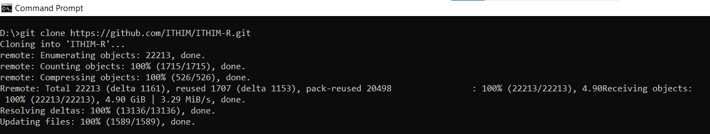

```{r, include = FALSE}
knitr::opts_chunk$set(
  collapse = TRUE,
  comment = "#>"
)
```

# How to run ITHIM-Global

In this guide we explain how to install the ITHIM-R package, how to run the model ITHIM-Global using this package and how to produce summaries of the key results.

Please note that the guide was written for Windows 10 but should work similarly for different operating systems. We are using the latest R version - at the time of writing, which is `R version 4.3.3 (2024-02-29)`.

## How to install the ITHIM-R package

### Pre-requisites

The following programmes need to have been installed before the ITHIM-R package can be used:

-   [Git](https://github.com/git-guides/install-git)

-   [R](https://cran.r-project.org/) - `version 4.3.3 (2024-02-29)` or above

-   [R Studio](https://posit.co/download/rstudio-desktop/)

### Cloning the Github repository

To clone (i.e. download) the ITHIM-R Github repository, open a command window by pressing the `More` button in the `Git` tab, and then press `New Terminal`

{width="100%"}

and then this terminal window will appear

{width="100%"}

navigate to the folder in which you want to install the repository in and type:

```         
git clone https://github.com/ITHIM/ITHIM-R.git
```

{width="100%"}

[**Note**]{.underline}: If you'd like to install just the latest version and ignoring the history, you may use `--depth 1` parameter, such as:

```         
git clone https://github.com/ITHIM/ITHIM-R.git --depth 1
```

This will be much quicker to install.

The Github repository has now been downloaded to your computer and the working branch - the default branch, is set to `bogota` which is this documentation refers to.

### Installing the package in RStudio

To open the ITHIM-R package in RStudio double click on the ITHIM-R.Rproj file inside the ITHIM-R folder saved on your computer. This should open the package in RStudio. 

#### Install all dependent packages

Before we install the `ITHIM` package, we need to make sure that all the dependent packages are already installed on your computer. For that process to continue, please make sure that you already have installed the `renv` package. If it is not installed, please run this command on your console:

```         
install.packages("renv")
```

This will install the package and you will see this message

> package `renv` successfully unpacked and MD5 sums checked

Once that is completed, you may use the package `renv` to verify/check if you already have all the dependent R packages for `ithim` locally installed on your computer.

For that, please run the command:

```         
renv::status()
```

{width="100%"}

In case of missing or out of date packages, this will display a list of them, and then you may run the `restore` function to have them all updated/installed, as:

```         
renv::restore()
```

{width="100%"}

This will update and install all the required packages.

#### Install the ITHIM-R package

To install the ITHIM-R package in RStudio, the following steps need to be performed:

1.) If Git has been installed then there should be a `Build` tab in the top right hand corner of RStudio. Click on this tab and then on `Install` in the panel below it.

{width="100%"}

To get the newest updates of the Bogota branch, go to the `Git` tab in RStudio next to the `Build` tab and click on `Pull`. This will automatically download the newest changes from Github. To update the ITHIM-R package on your computer, you need to again go to the `Build` tab and click on `Install` again. (Alternatively, if only code but none of the input files have been changed, instead of clicking on `Install`, you can also click on `More` and then `Load All` if this option exists for you, i.e. if `devtools` has been installed. This is a faster way to update the package but will only work for minor code changes.) It is recommended to pull and install the newest updates on a regular basis.

{width="100%"}

## Running ITHIM-Global

To run ITHIM-Global using the ITHIM-R package the various input files and parameters need to be updated first. Then the multi_city_script.R can be used to call the core functions required to run ITHIM-R. Note that the multi_city_script.R is set up to run ITHIM-Global for various cities in one go if required by looping through the cities one by one.

### Update input parameters

There are several input parameters files that need updating before running ITIHM-Global:

-   5 files specific to each city saved in a directory of the city's name. (See [inst/ext/local/bogota](https://github.com/ITHIM/ITHIM-R/tree/bogota/inst/extdata/local/bogota) for example files and also below for further information). These files need to be saved in the inst/extdata/local/'city' folder, where `city` is replaced by the appropriate city name.

-   file containing the various input parameters for all cities for which the code is to be run saved in the ITHIM-R folder. In this branch, this file is called Bogota_InputParameters_vxx.xlsx, where vxx refers to the latest version number of this file. Here it only contains the input parameters for Bogota but it can easily be extended to contain the input parameter values for various cities, using the same format and structure shown in the sheet.

-   global datasets - such as the exposure-response relationships for the air pollution pathway. These files can be found in the [inst/extdata/global](https://github.com/ITHIM/ITHIM-R/tree/bogota/inst/extdata/global) folder and usually do not need to be changed, unless the user has different preferences. See below for further information.

#### City-specific files (local input parameters/datasets).

This section covers the 5 city-specific input files required to run the model.

-   **Travel survey** [(example trips dataset)](https://raw.githubusercontent.com/ITHIM/ITHIM-R/bogota/inst/extdata/local/bogota/trips_bogota.csv). A table of all trips taken by a group of people on a given weekday. It also includes people who take no trips. This data should come from an official travel survey for the city where possible.

    -   One row per trip (or stage of trip)
    -   Minimal columns: `participant_id`, `age`, `sex`, `trip_mode`, `trip_duration` (or `trip_distance`)
    -   Other columns: `stage_mode`, `stage_duration` (or `stage_distance`)

-   **Injury events** [(example injuries dataset)](https://raw.githubusercontent.com/ITHIM/ITHIM-R/bogota/inst/extdata/local/bogota/injuries_bogota.csv). A table of recorded road-traffic injury (fatality) events in a city during one or more years.NOV refers to No Other Vehicle.

    -   One row per event
    -   Minimal columns: **victim mode** (`cas_mode`) and **strike mode** (`strike_mode`)
    -   Other columns: `year`, `cas_age`, `cas_gender`, `weight` (weight column should give number of years for which data exists if no `year` information is given)

-   **Baseline mortality and years of life lost** [(example dataset)](https://raw.githubusercontent.com/ITHIM/ITHIM-R/bogota/inst/extdata/local/bogota/gbd_bogota.csv). This gives the burden of mortality and years of life lost (YLL) for different causes of mortality and YLL. If no city-specific information exists, country level information can be used.

    -   One row per health outcome/metric/age/gender combination
    -   Minimal rows: `Measure` (death/YLL); `sex_name` (Male/Female); `age_name` ('x to y'); `cause_name` (health outcome names); `val` (value of burden); `population` (number of people `val` corresponds to, e.g. population of country)

-   **Population of city** [(example population dataset)](https://raw.githubusercontent.com/ITHIM/ITHIM-R/bogota/inst/extdata/local/bogota/population_bogota.csv). This information is used to scale the baseline mortality and YLL data from the country's value to the city's population under study.

    -   One row per demographic group
    -   Columns: `sex`, `age`, `population`
    -   `age` column should share boundaries with `age_name` in the baseline mortality and YLL data, but can be more aggregated.

-   **Physical activity survey** [(example physical activity dataset)](https://raw.githubusercontent.com/ITHIM/ITHIM-R/bogota/inst/extdata/local/bogota/pa_bogota.csv). This is used to represent the physical activity levels in the city and should be taken from an official physical activity survey of the city where possible.

    -   One row per person
    -   Columns: `sex`, `age`, `ltpa_marg_met` (background non-transport, non-occupational weekly PA volume in mMETS hours)

#### Global files (global input parameters/datasets)

In order to setup the model, we need a fixed list of tables/datasets, which do not change across cities/ applied similarly to all cities and are hence referred to as “Global”, such as:

-   [**Health outcome interaction table**](https://raw.githubusercontent.com/ITHIM/ITHIM-R/bogota/inst/extdata/global/dose_response/disease_outcomes_lookup.csv). A table with a list of health outcomes related to a specific pathway such as `Air Pollution` and `Physical Activity` and also the interaction between them.

-   [**Air Pollution Exposure Response Functions (ERFs)**](https://github.com/ITHIM/ITHIM-R/tree/bogota/inst/extdata/global/dose_response/drap/extdata)**.** These give the exposure-response relationships between air pollution (PM2.5) and its impact on health for different health outcomes. We have collected/cleaned datasets from published studies for this.

-   [**Physical Activity Dose-Response Functions (DRFs)**](https://meta-analyses.github.io/drpa/drpa.html). These are dose-response relationships of physical activity and its impact on health for different health outcomes. Similar to air pollution, this too comes from published studies. This now sits in an independent R package called [`drpa`](https://github.com/meta-analyses/drpa/).

-   **Ventilation rate tables**. This data can be found in [inst/extdata/global/ventilation_rate](https://github.com/ITHIM/ITHIM-R/tree/bogota/inst/extdata/global/ventilation_rate) and details the distribution and parameters required to estimate how much air is being inhaled by different people across different activities in the model’s baseline population.

### Call multi_city_script.R

In order to run ITHIM-R once it has been installed and the various input files described above have been updated, open the `multi_city_script.R` file within RStudio. This file can be found under the `Files` tab in the middle pane on the right hand side. This is the key script to run ITIHM-Global in constant mode (i.e. keeping the input parameters fixed, without sampling the input parameters from distributions). It reads in all the required datasets and initialises all variables by calling `run_ithim_setup` and then runs the model by calling `run_ithim`.

First, update the parameter values at the beginning of the script to set-up e.g. for which city / cities the script is to be run. This can be found in Line 63 and has been set to ‘bogota’ in this worked example.

{width="100%"}

<https://github.com/ITHIM/ITHIM-R/blob/de2a88548af6c6be5eb36d939e178b146d1ba055/multi_city_script.R#L63>

If several city names are given as a vector, the model performs the ITHIM-R analysis for one city after another.

Once these parameter values have been updated, click on `Source` and the model should run.

{width="100%"}

It produces pop-up windows showing the plots of the results giving the years of life lost for each scenario and required health outcomes.

### ithim_objects

The ithim_objects list is saved under *results/multi_city/io\_",output_version,".rds*, where the output_version is currently set as the SHA number (i.e. the unique identifier) of the latest update on Github but can also be updated manually by the user in the `multi_city_script.R`.

You may view it using the command `View(ithim_objects)` and it will then show you its content as such:

{width="100%"}

You may click on individual sub-items such as `bogota` for more information.

{width="100%"}

This list contains a comprehensive set of intermediate and final results from the model run:

For each city modelled it contains the following data:

-   **trip_scen_sets**: trip data for all scenarios for the baseline population, i.e. the population sample built by combining the household travel survey and physical activity survey data.

-   **dist**: total stage mode distances for each mode and scenario (including baseline) for the baseline population.

-   **dur**: total stage mode durations for each mode and scenario (including baseline) for the baseline population.

-   **true_dist**: distances from the trip data scaled up to the total distance travelled by the baseline population of the city (for age ranges considered in the model only) for each scenario (including baseline) and mode of transport.

-   **inj_distances**:

    -   **true_distances**: city baseline population mode distances by age category and sex considered in the model.

    -   **injuries_list**: For all scenarios (including baseline) two lists are given, one for `whw` (who-hit-whom) injuries where both the strike and the casualty mode are known and one for `nov` (no other vehicle) injuries where no strike vehicle was involved in the crash These lists contain all casualty (and strike) mode combinations by age category and sex. Furthermore, they detail casualty (and strike) mode distances travelled by the entire city baseline population considered in the model ('\_sum') or just by the respective age and sex category. They also detail the casualty (and strike) mode exponents used in the injury Poisson regression model.

    -   **reg_model**: parameterised Poisson injury regression model for injuries.

    -   **injuries_for_model**: baseline data containing fatality counts for all casualty and strike mode combinations with associated city's baseline population distance data (`true_distances` explained above) .

-   **demographic**: city population counts for all age categories and sex combinations considered in the model.

-   **synth_pop**: population extracted from the physical activity survey assigning non-transport, non-occupational PA component of physical activity values in mMETs hours per person per week.

-   **outcomes**:

    -   **mmets**: Marginal MET values for each person in the baseline population for each scenario.

    -   **pm_conc_pp**: PM2.5 concentration attributed to each person in the baseline population for each scenario (including baseline).

    -   **co2_emission_inventory**: total CO2 emission levels for each mode of transport and scenario (including baseline).

    -   **ref_injuries**: number of injury deaths and years of life lost by age and sex category for the baseline scenario including upper and lower confidence interval values

    -   **hb**: health burden (deaths and years of life lost (YLL) in two separate dataframes) for each age and sex category and each health outcome using the combined result for health outcomes impacted by both air pollution and physical activity levels.

    -   **pathway_hb**: health burden (deaths and years of life lost (YLL) in two separate dataframes) for each age and sex category and each health outcome keeping the results for health outcomes impacted by both air pollution and physical activity levels separate.

    -   **whw**: number of fatalities by strike and casualty modes for who-hit-whom and no-other-vehicle injuries for all scenarios (including baseline).

-   **disease_burden**: health outcome burden for all health outcomes for the baseline scenario (deaths and years of life lost) for all age and sex categories considered in the model (from input data).

-   **PM_emission_inventory**: PM emission inventory by mode of transport for the baseline scenario (from input data).

-   **injury_table**: summarised total road fatality counts from the injury input data by age and sex category and strike and casualty mode for all years (`weight` column) given in the input data for both `whw` (who-hit-whom) and `nov` (no-other-vehicle) injuries.

-   **vehicle_inventory**: gives the speed and CO2 and PM2.5 emissions inventories for all vehicles in the baseline scenario.

-   **location**: country and continent information.

-   **new_walk_trips_count**: number of rail and bus trips to which an additional walking stage was added during the model run.

**Scen_prop**:

-   the proportion of trips by mode to be converted for each distance category and scenario.

**Ithim_run**:

-   information about the ITHIM-R run such as the name of the input parameters file, the name of the scenario definition used, the baseline scenario, the scenario names, the computation mode (constant or sample), the timestamp of the model run, the output version number, the author of the model run and any additional comments about this particular model run.

### Summary of key results

There are various scripts which can be used to produce output summary tables of the results:

-   three markdown documents (in root folder, as shown below) producing html and csv files:

    -   summary_tables.Rmd
    -   summary_tables_PA_AP.Rmd
    -   injury_tables.Rmd

Note: please execute the command below

```         
source("Create_output_summaries.R")
```

to run (or `knit`) all three documents above - this will produce html files and along with the necessary CSV files (stored in the `results` subfolder)

-   Shiny application creating a Pivot table:

    -   app.R in results_app folder

#### Producing the .Rmd file outputs

To run the various .Rmd files, you can use the `Create_output_summaries.R` script saved in the root folder by `source("Create_output_summaries.R")`

The following outputs are produced:

#### summary_tables.Rmd

The .Rmd file summarises mode splits, distances and durations travelled, in addition to the attributable health impacts (YLL and deaths from different health outcomes) for the different injury, physical activity (PA) and air pollution (AP) pathways but also by health outcome

It produces the following output documents:

-   html file (saved in the root folder) containing the information listed below.

Note that the Rmd file was set up to produce many more distance, duration and health outcomes tables which have all been commented out to highlight the main results but could easily be added in again:

-   a table displays the Baseline mode split for each distance category, in this case: 0-2 km, 2-6 km and \>6km

-   a table displays the mode split for each scenario

-   city-specific distance tables showing average daily distances in km travelled by each person in the baseline population by mode for all scenarios (including Baseline)

-   city-specific distance tables showing average daily distances in km travelled by each person in the baseline population WITH a trip by mode for all scenarios (including Baseline)

-   city-specific duration tables showing average daily duration (mins) spent travelling by each person in the baseline population by mode for all scenarios (including Baseline)

-   city-specific duration tables showing average daily duration (mins) spent travelling by each person in the baseline population WITH a trip by mode for all scenarios (including Baseline)

-   output .csv files containing the information listed below. Note that all these files are also saved with their version number in the file name:

    -   the ylls.csv file (results/multi_city/health_impacts/ylls.csv) gives the changes in YLL for each age and sex category, health outcome and scenario as compared to the baseline scenario. It also shows the health outcomes in the three level heirarchy, and whether the health outcome is attributed to changes in AP, PA or both, and the age, and age and sex specific population levels. The results are for either AP and PA only if the health outcomes are only impacted by AP or PA seperately, or the results are combined for AP and PA, if the health outcomes are impacted by both AP and PA.

    -   the ylls_pathway.csv file (results/multi_city/health_impacts/ylls_pathway.csv) gives the changes in YLL for each age and sex category, health outcome and scenario as compared to the baseline scenario. It also shows the health outcome in the three level hierarchy, and whether the health outcome is attributed to changes in AP or PA, and the age, and age and sex specific population levels. The results are given for AP and PA independently even if a health outcome is impacted by both pathways.

    -   the deaths.csv file (results/multi_city/health_impacts/deaths.csv) gives the changes in deaths for each age and sex category, health outcome and scenario as compared to the baseline scenario. It also shows the the health outcomes in the three level hierarchy, whether the health outcome is attributed to changes in AP, PA or both, and the age, and age and sex specific population levels. The results are for either AP and PA only if the health outcomes are impacted by only AP or PA or the results are combined for AP and PA impacts if the health outcomes are impacted by both AP and PA.

    -   the deaths_pathway.csv file (results/multi_city/health_impacts/deaths_pathway.csv) gives the changes in deaths for each age and sex category, health outcome and scenario as compared to the baseline scenario. It also shows the health outcome in the three level hierarchy, and whether the health outcome is attributed to changes in AP or PA, and the age, and age and sex specific population levels. The results are given for AP and PA independently even if a health outcome is impacted by both pathways.

#### summary_tables_PA_AP.Rmd

This .Rmd file can be used to summarise the ambient PM2.5 concentrations, the PM2.5 personal exposure levels, CO2 emissions and physical activity levels for all scenarios including the baseline.

It produces the following output documents:

-   html file (saved in the root folder) containing the information listed below:

    -   boxplots of daily individual PM2.5 exposure levels for each scenario including baseline

    -   one table detailing the individual PM2.5 exposure levels including the mean, 5th, 50th and 95th percentiles, the mean PM2.5 concentration levels for each scenario and the change in PM2.5 as compared to the baseline scenario

    -   one table detailing the percentage of baseline PM2.5 emissions attributed to each transport mode, the city wide PM2.5 concentration and the percentage of concentration attributed to transport

    -   one table detailing the baseline CO2 emissions for each scenario

    -   boxplots of individual mMET physical activity levels for each scenario

    -   one table giving the mean, 5th, 50th and 95th percentile levels of individual physical activity levels (mMETs) for each scenario

    -   one table detailing the average mMETs levels for each scenario

    -   2nd Option:

        -   boxplots of daily individual PM2.5 exposure levels for each scenario

        -   one table detailing the baseline PM2.5 emissions for each mode, the city wide PM2.5 concentration and the percentage of concentration attributed to transport

        -   one table detailing the individual PM2.5 exposure levels including the mean, 5th, 50th and 95th percentiles, the mean PM2.5 concentration for each scenario and the change in PM2.5 as compared to the baseline scenario. The table also contains CO2 emissions for each scenario

        -   boxplots of individual mMET physical activity levels for each scenario

-   output .csv/.xlsx files containing the information listed below:

    -   desc_stats.csv file (results/multi_city/AP/desc_stats.csv, also saved with output version in name) containing the summary statistics of individual PM2.5 exposure levels, the total PM2.5 concentration, the change in PM2.5 concentration as compared to the baseline scenario and the total transport related CO2 emissions for each scenario

    -   desc_stats.xlsx file (results/multi_city/AP/desc_stats\_*output_version*.xlsx) containing the following tabs:

        -   PM_2.5_emission_inventory: table detailing the percentage Baseline PM2.5 emissions attributed to each transport mode, the city wide PM2.5 concentration and the percentage of concentrations attributed to transport

        -   CO2_emission_inventory: table detailing the CO2 emissions for each scenario

        -   summary_stats_PM2.5_CO2: summary statistics of individual PM2.5 exposure levels, the total PM2.5 concentration, the change in PM2.5 concentration as compared to the baseline scenario and the total transport related CO2 emissions for each scenario

#### injury_tables.Rmd

This .Rmd file can be used to summarise the injury outcomes. It produces the following output documents:

-   html file (saved in the root folder) containing the information listed below:

    -   fatality counts by strike and casualty mode for each scenario (including lower and upper confidence interval values were applicable); one table for each scenario and mean, upper or lower confidence interval values

    -   fatality counts giving lower, mean and upper bounds (where applicable) for each casualty mode by strike mode for each scenario; one table for each casualty mode, scenario

    -   tables showing the fatalities per billion km travelled for each scenario and mean, upper and lower confidence interval values (where applicable).

    -   tables showing the number of deaths per 100,000 people for each scenario and mean, upper and lower confidence interval values (where applicable).

    -   tables showing the fatalities per 100 million hours travelled for each scenario and mean, upper and lower confidence interval values (where applicable).

-   output .csv files containing the information listed below. Note that all these files are also saved with their version number in the file name:

    -   The inj_counts.csv file (`results/multi_city/inj/inj_counts.csv`) contains the fatality counts (mean and upper and lower confidence interval values if required, each in their seperate row) for each scenario and casualty and strike mode pair. It also includes the observed baseline fatality counts and the active travel fatality counts under the casualty mode (the sum of cycle and walk casualty mode fatalities)

    -   The injury_risks_per_billion_kms.csv file (`results/multi_city/inj/injury_risks_per_billion_kms.csv`) gives the fatalities per billion km travelled for each scenario and casualty mode. It also includes the upper and lower confidence interval values if required, each in their separate row, and active travel counts which sum walking and cycling

    -   The injury_risks_per_100k_pop.csv file (`results/multi_city/inj/injury_risks_per_100k_pop.csv`) gives the fatalities per 100k people for each scenario and casualty mode. It also includes the upper and lower confidence interval values if required, each in their separate row, and active travel counts which sum walking and cycling

    -   The distances.csv file (`results/multi_city/inj/distances.csv`) contains the population distances travelled per day for each scenario and mode

    -   The injury_risks_per_100million_h.csv file (`results/multi_city/inj/injury_risks_per_100million_h.csv`) gives the fatalities per 100 million hours travelled for each scenario and casualty mode. It also includes the upper and lower confidence interval values if required, each in their seperate row, and active travel counts which sum walking and cycling

-   The inj_data.xlsx file (results/multi_city/inj/inj_data.xlsx) contains all injury output csv files

#### Shiny App Pivot table

This application allows you to produce Pivot tables for both health and injury outcomes. The Pivot tables allow you to filter the outcomes as follows.

-   for the health outcomes (which include road traffic injuries (RTI)):
    -   by scenario
    -   by deaths or years of life lost
    -   by health outcome levels in the three levels hierarchy
    -   by age and sex group
    -   by pathway / dose
    -   whether to include the interaction between the air pollution and physical activity pathways or not
    -   whether to include confidence intervals or not
-   for the injury risks:
    -   by scenario
    -   by mode
    -   by risk type (total fatalities, per billion km, per 100k people, per 100 million hours)

#### Producing the Shiny App Pivot table output

To produce these Shiny App Pivot tables, run the function `app.R` in the `results_app` folder. Depending on whether you want to read in the results from the latest updates on Github or from your local drive, set

```         
github_path <- "https://raw.githubusercontent.com/ITHIM/ITHIM-R/bogota/"
```

or

```         
github_path <- "../"
```

(Comment out the option you don't need.)

## Structure of ITHIM-Global Github repository - Bogota branch

The Github repository of the Bogota branch is structured as follows:

-   **.github**: specifies the metadata for the various documents, automatically created by Github.

-   **R**: contains all the R functions written for the ITIHM-R package.

-   **inst/extdata**: folder containing the local city-specific and the global input files.

-   **man**: manual containing the various functions used within ITHIM-R and the figures used in the various documentation documents. It is also built automatically.

-   **results**: contains the results from the model runs.

-   **results_app**: contains the functions used to produce Shiny pivot tables of the results.

-   **vignettes**: contains additional documentation information

-   .Rbuildignore, .gitignore: metadata created by Github.

-   Bogota_InputParameters_vxx.xlsx - file containing the local city-specific input parameters which needs manual updating.

-   Create_output_summaries.R - wrapper script to create the various output documents.

-   DESCRIPTION: automatically created by Github.

-   How_To_Run_ITHIM: document describing the various steps needed to run the ITHIM-Global model from downloading and installing ITHIM-R to preparing the input parameters files and running the code.

-   ITHIM-R.Rproj: contains the metadata for the ITHIM-R package.

-   LICENSE: gives information about the licence that has been applied to this repository.

-   NAMESPACE: automatically created by Github.

-   OutputVersionControl.txt: file storing the main run information of the ITHIM-R runs. This is automatically updated, if required, when using the multi_city_script.R.

-   README: document giving an overview of the ITHIM-R package.

-   \_config.yml, \_pkgdown.yml: metadata created by Github.

-   injury_tables.Rmd: R markdown document that can be used to create summary statistics of the injury results.

-   injury_tables\_*output_version*.html: html files containing injury summary statistics of the respective model runs.

-   multi_city_script.R: wrapper function to call all the various functions needed to perform the ITHIM-Global analysis.

-   summary_tables.Rmd: R markdown document to create summary output statistics about distance, duration, mode splits and health outcomes.

-   summary_tables\_*output_version*.html: html files containing output summaries of the respective model runs.

-   summary_tables_PA.Rmd: R markdown document to create summary output statistics about air pollution and physical activity levels.

-   summary_tables_PA\_*output_version*.html: html files containing air pollution and physical activity output statistics of the respective model runs.
